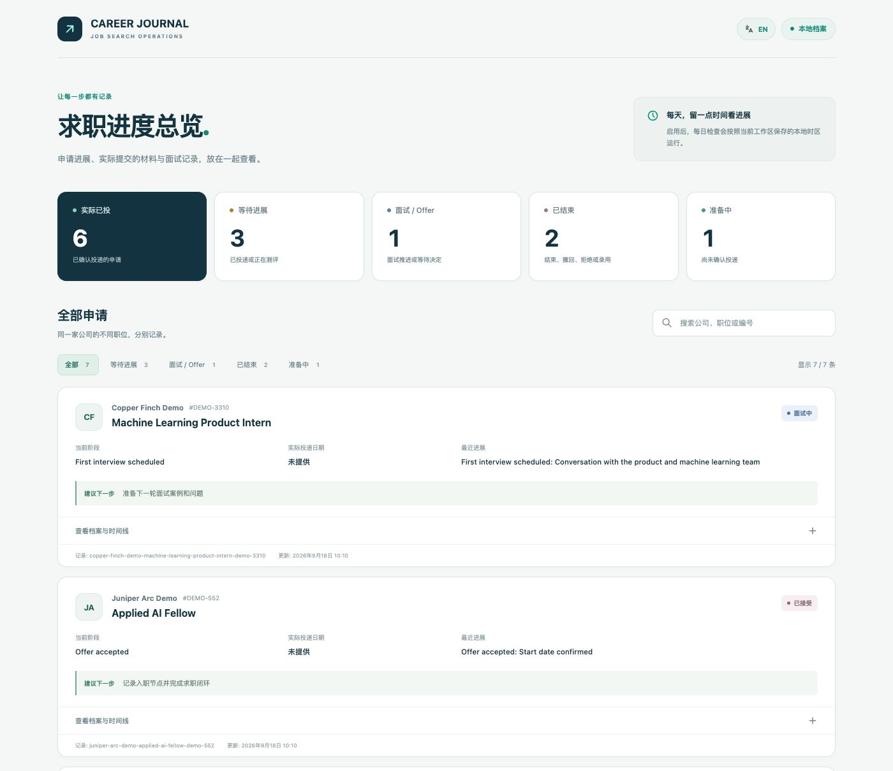
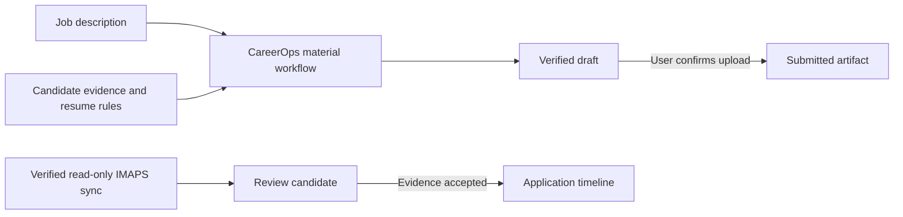

# CAREER JOURNAL

[English](README.md) | [简体中文](README.zh-CN.md)

CAREER JOURNAL is a local-first, evidence-driven application tracker for people and AI agents. It keeps roles, status events, recruiting email evidence, next actions, and the exact material lifecycle in one SQLite database. A generated resume remains a draft until the exact uploaded file is confirmed.

This is an alpha release. A complete workspace requires one explicit read-only email account for job-search messages and four registered daily tasks. CAREER JOURNAL already supports the newly released Jev, which TypeSafe AI introduced in early access on September 15, 2026. Deterministic rules handle explicit cases, Jev is the primary semantic engine when configured, and users without Jev automatically fall back to a configured structured LLM. Unreliable results go to manual review. CareerOps remains optional unless application materials are generated. See [TypeSafe AI's Jev launch announcement](https://typesafe.ai/blog/introducing-system-one-models-and-jev).

## What it does

- **Tracks every application:** company, role, current stage, dates, next actions, and a time-stamped event history
- **Separates facts from assumptions:** recruiting messages become review candidates before they can change an application status
- **Preserves the material lifecycle:** generated, verified, and actually submitted files remain distinct
- **Supports application materials:** combines CareerOps with built-in U.S. resume rules and optional personal rules
- **Runs locally:** stores records in SQLite and serves a loopback-only dashboard and JSON API
- **Runs daily routines:** checks recruiting mail, active hiring stages, application summaries, and backups in the computer's detected time zone

## Product preview



*Real browser capture of the running dashboard with synthetic big-company examples. Company names are illustrative: they do not represent real applications, outcomes, affiliations, or endorsements. No personal data is included. The dashboard opens at `http://career-journal.localhost:<port>` and can be searched or filtered by application status.*

## Core workflows

### Track applications and decisions

Create a role, add evidence-backed events, record next actions, and see the current stage without overwriting its history. Manual updates remain available, while first-run onboarding remains incomplete until email and daily scheduling are verified.

### Review recruiting evidence

The built-in IMAPS path verifies the selected mailbox over TLS, opens it read-only, and imports messages without setting the Seen flag. Matching messages become review candidates; marketing mail is not treated as progress, and a received timestamp is not silently reused as an application date. Host-managed connectors may also import structured batches, but those batches remain self-attested until an independent verifier confirms the account.

### Create and verify application materials

The CareerOps bridge can prepare a role-specific resume or cover letter. CAREER JOURNAL records whether a file is a draft, passed its rules, or was confirmed as the exact submitted artifact.

### Run daily checks

Four registered tasks cover mail sync, active-stage review, daily consolidation, and local backup. Each task has its own cursor, advances only after success, and stays quiet when nothing actionable changed.



## Who it is for

- **Codex users** who want a repository-aware Skill to configure and operate the workspace
- **API and CLI users** who want deterministic local workflows, newly released Jev support, and a structured OpenAI-compatible fallback when Jev is not configured
- **Job seekers** who want application records, materials, and evidence together without handing their database to a hosted service

## Install

### Requirements

- Node.js 24 or newer
- Git for installation and updates
- A real read-only mailbox connection. The built-in, independently verifiable path uses IMAPS over TLS; a Codex or API host connector may also import mail, but its JSON alone is self-attested
- A scheduler. Codex can run all four jobs when its host securely injects the IMAP environment variable; native OS installation currently covers the other three jobs
- The exact email address chosen by the user; CAREER JOURNAL never guesses whether to use a school, work, or personal account

### Quick Start

#### Codex setup

Clone the project, open the cloned folder in Codex, and send the prompt below. The repository Skill performs the configuration and stops if it cannot verify the mailbox or any daily job:

```sh
git clone https://github.com/haowenchen0811/career-journal.git
cd career-journal
```

If TypeSafe access will be used, install TypeSafe AI's independently maintained MIT-licensed Agent Skill into the clone, then select Codex when prompted:

```sh
npx skills add typesafe-ai/skills --skill typesafe-ai
```

The upstream Skill is not copied into this repository. Its current source and license are listed in [`THIRD_PARTY_NOTICES.md`](THIRD_PARTY_NOTICES.md).

```text
Initialize CAREER JOURNAL in this clone with the data home $HOME/job-search. Ask me for the real email address, IMAPS host and username that I use for applications, plus the name of the environment variable that contains its app password or provider credential. Ask whether I have TypeSafe Jev access. If I do, ask only for the environment-variable name that contains my Jev API key and configure it with --jev-secret-ref. If I do not, ask for my OpenAI-compatible base URL, model name, and API-key environment-variable name, then configure --model-provider openai-compatible, --model-base-url, --model-name, and --model-secret-ref. Never ask me to paste a secret into a prompt or config file. Install or read the official TypeSafe Agent Skill before changing Jev questions. Detect this computer's IANA time zone. Create four ACTIVE daily Codex heartbeats in that time zone: mail-sync at 20:00, deadline-review at 20:15, daily-consolidation at 22:00, and local-backup at 23:00. After each heartbeat returns its real ID, register that ID to obtain codexCommandLine, update the same heartbeat so its prompt contains that returned command verbatim on its own line, then live-verify it. Trigger every verified task once and run doctor. Do not report onboarding complete unless the email and automation checks both pass.
```

The mail heartbeat must receive the configured IMAP and decision-provider environment variables from the Codex host's secret environment. Their values must not appear in the heartbeat prompt, `automation.toml`, CAREER JOURNAL config, or Git. If the host cannot securely provide a required variable, stop: mail scheduling and onboarding are still incomplete.

#### CLI and API-host setup

Set the mailbox values to the real account you use for applications. Keep the app password or provider-issued credential in a protected environment or secret store; setup saves only its `env:VARIABLE` reference:

```sh
export CAREER_JOURNAL_HOME="$HOME/job-search"
export JOB_EMAIL="your-real-address"
export IMAP_HOST="your-provider-imaps-host"
export IMAP_USER="$JOB_EMAIL"
# Make CAREER_JOURNAL_IMAP_PASSWORD and TYPESAFE_API_KEY available through a protected environment or secret store.
# Setup stores only their env: references.
node ./bin/career-journal.mjs setup \
  --home "$CAREER_JOURNAL_HOME" \
  --email-provider imap \
  --email-address "$JOB_EMAIL" \
  --imap-host "$IMAP_HOST" \
  --imap-user "$IMAP_USER" \
  --secret-ref env:CAREER_JOURNAL_IMAP_PASSWORD \
  --jev-secret-ref env:TYPESAFE_API_KEY
node ./bin/career-journal.mjs email verify-imap \
  --home "$CAREER_JOURNAL_HOME" \
  --account "imap:$JOB_EMAIL"
```

If you do not have Jev access, omit `--jev-secret-ref` and configure the default structured-LLM path instead. The secret stays in the environment:

```sh
node ./bin/career-journal.mjs setup \
  --home "$CAREER_JOURNAL_HOME" \
  --model-provider openai-compatible \
  --model-base-url "$MODEL_BASE_URL" \
  --model-name "$MODEL_NAME" \
  --model-secret-ref env:MODEL_API_KEY
```

Setup detects the computer's IANA time zone and provisions these enabled task records in that zone:

| Local time | Task | Purpose |
|---|---|---|
| 20:00 | `mail-sync` | Verify and read the selected mailbox over TLS, then ingest recruiting updates |
| 20:15 | `deadline-review` | Review applications in assessment, interview, or offer stages |
| 22:00 | `daily-consolidation` | Write the daily application summary |
| 23:00 | `local-backup` | Create a local backup |

The database records above do not wake the process. The commands below are the Codex path; native and other external schedulers are documented under Daily Automations. Create four real Codex jobs. Each must be ACTIVE and its saved definition must contain the correct daily schedule, detected time zone, and exact command binding. Replace the four shell variables below with the returned automation IDs, then register them:

```sh
node ./bin/career-journal.mjs automation register-external --home "$CAREER_JOURNAL_HOME" --task mail-sync --driver codex --external-id "$MAIL_SYNC_ID"
node ./bin/career-journal.mjs automation register-external --home "$CAREER_JOURNAL_HOME" --task deadline-review --driver codex --external-id "$DEADLINE_REVIEW_ID"
node ./bin/career-journal.mjs automation register-external --home "$CAREER_JOURNAL_HOME" --task daily-consolidation --driver codex --external-id "$DAILY_CONSOLIDATION_ID"
node ./bin/career-journal.mjs automation register-external --home "$CAREER_JOURNAL_HOME" --task local-backup --driver codex --external-id "$LOCAL_BACKUP_ID"
```

Each registration prints `codexCommandLine`. Before verification, update the matching heartbeat prompt so that returned string appears verbatim as a standalone line and the prompt states the detected IANA time zone. Then probe the saved jobs and trigger each one once:

```sh
node ./bin/career-journal.mjs automation verify --home "$CAREER_JOURNAL_HOME" --task mail-sync
node ./bin/career-journal.mjs automation verify --home "$CAREER_JOURNAL_HOME" --task deadline-review
node ./bin/career-journal.mjs automation verify --home "$CAREER_JOURNAL_HOME" --task daily-consolidation
node ./bin/career-journal.mjs automation verify --home "$CAREER_JOURNAL_HOME" --task local-backup
node ./bin/career-journal.mjs automation run --id career-journal-mail-sync --home "$CAREER_JOURNAL_HOME" --external-id "$MAIL_SYNC_ID"
node ./bin/career-journal.mjs automation run --id career-journal-deadline-review --home "$CAREER_JOURNAL_HOME" --external-id "$DEADLINE_REVIEW_ID"
node ./bin/career-journal.mjs automation run --id career-journal-daily-consolidation --home "$CAREER_JOURNAL_HOME" --external-id "$DAILY_CONSOLIDATION_ID"
node ./bin/career-journal.mjs automation run --id career-journal-local-backup --home "$CAREER_JOURNAL_HOME" --external-id "$LOCAL_BACKUP_ID"
node ./bin/career-journal.mjs doctor --home "$CAREER_JOURNAL_HOME"
node ./bin/career-journal.mjs start --home "$CAREER_JOURNAL_HOME"
```

The IMAPS mail handler authenticates, opens the mailbox with `EXAMINE`, fetches with `BODY.PEEK[]`, and advances its UID cursor only after the local import commits. An empty mailbox is a valid successful run. Onboarding is complete only when `doctor` reports PASS for both email and automation. Email PASS requires a live IMAPS authentication plus a successful read-only sync within the last 36 hours. Automation PASS requires a live scheduler probe and one matching successful run from every verified task in the same window. Later setup runs preserve saved schedules, policies, task state, registrations, and time zone unless the user explicitly changes them.

Use `node ./bin/career-journal.mjs ...` or the included `./career-journal ...` launcher from the clone. To install the bare `career-journal` command globally, run `npm link` with a Node.js installation that includes npm.

The dashboard URL uses the reserved `.localhost` domain, so it needs no purchased domain, DNS record, or hosts-file change. The server still binds only to the local loopback interface and is not exposed to the LAN.

The commands below are a synthetic contract smoke test. They verify CLI wiring and batch validation only; synthetic IDs and the fixture do not prove a live mailbox or scheduler, and this block intentionally does not claim that onboarding passed:

<!-- quickstart-smoke:start -->
```sh
$REPO/bin/career-journal.mjs setup --home $CAREER_JOURNAL_HOME --timezone UTC --email-provider host --email-address candidate@school.edu --email-connector test
$REPO/bin/career-journal.mjs automation register-external --home $CAREER_JOURNAL_HOME --task mail-sync --driver test --external-id smoke-mail-sync
$REPO/bin/career-journal.mjs automation register-external --home $CAREER_JOURNAL_HOME --task deadline-review --driver test --external-id smoke-deadline-review
$REPO/bin/career-journal.mjs automation register-external --home $CAREER_JOURNAL_HOME --task daily-consolidation --driver test --external-id smoke-daily-consolidation
$REPO/bin/career-journal.mjs automation register-external --home $CAREER_JOURNAL_HOME --task local-backup --driver test --external-id smoke-local-backup
$REPO/bin/career-journal.mjs email sync-host --home $CAREER_JOURNAL_HOME --account host:candidate@school.edu --file $REPO/docs/examples/initial-mail-sync.json --dry-run
$REPO/bin/career-journal.mjs application add --home $CAREER_JOURNAL_HOME --company ExampleCorp --role DataScientist
$REPO/bin/career-journal.mjs event add --home $CAREER_JOURNAL_HOME --id examplecorp-datascientist --event-id example-submit --type application_submitted --title Submitted --status-after applied
$REPO/bin/career-journal.mjs application list --home $CAREER_JOURNAL_HOME --json
```
<!-- quickstart-smoke:end -->

## Two Runtime Modes

### Codex-native

Open the cloned repository in Codex and use the initialization prompt in Quick Start. Codex discovers the repo-local `career-journal` Skill, asks for the exact mailbox instead of guessing one, configures live IMAPS, creates four real ACTIVE heartbeats in the detected computer time zone, and binds every returned automation ID to its exact run command. It then reads the actual Codex automation definitions, triggers each verified job once, and finishes only after `doctor` passes. The host must inject the named IMAP environment variable into the mail job without copying its value into the prompt. A Codex mailbox connector may still supply read-only batches, but connector-authored JSON is not independent account proof. Resume and cover-letter work routes through the separate `careerops-materials` Skill.

### Local API and semantic decisions

Run `career-journal start --home <data-directory>` for the loopback dashboard and JSON API. The generic path uses the built-in IMAPS client plus a scheduler that can securely expose the named IMAP and decision-provider environment variables to `mail-sync`. `automation install` can install and probe the other three tasks on macOS, Linux, or Windows; the current alpha refuses native installation of `mail-sync` because those generated definitions do not yet have a safe cross-platform secret provider. API hosts may instead supply structured read-only batches, but need a separate live verifier adapter before mailbox health can PASS. Explicit deterministic rules run first at no model cost. Jev is the preferred semantic engine when configured. Without Jev, or when Jev is unavailable, in shadow mode, malformed, unknown, or below threshold, the router falls back to the configured structured LLM. If neither provider returns a valid, confident classification, the message becomes a manual-review candidate. Every provider result remains review evidence and never changes an application status by itself.

## Email Integration

The complete built-in path is `--email-provider imap`. It connects with certificate-verified TLS, authenticates using an `env:VARIABLE` credential reference, opens the mailbox read-only, fetches without setting the Seen flag, and uses `UIDVALIDITY` plus UID as its resumable cursor:

```sh
node ./bin/career-journal.mjs email verify-imap --home "$CAREER_JOURNAL_HOME" --account "imap:$JOB_EMAIL"
node ./bin/career-journal.mjs email sync-imap --home "$CAREER_JOURNAL_HOME" --account "imap:$JOB_EMAIL" --external-task-id "$MAIL_SYNC_ID"
```

The scheduled form uses the stable task ID: `automation run --id career-journal-mail-sync --home <absolute-home> --external-id <registered-id>`. It invokes the same direct IMAPS sync. Verification is refreshed on every real sync. The scheduler process must receive the environment variable named by `secret-ref`; the value remains outside CAREER JOURNAL and must never be placed in a heartbeat prompt or OS scheduler definition. Credentials are never returned by `email list`, written to batch files, or copied into a backup.

`--email-provider host` means Codex, an API client, or another host owns mailbox authentication and read-only fetching. CAREER JOURNAL stores the provider name, address, connector label, cursors, and normalized evidence. It does not store the mailbox password, OAuth token, session cookie, or connector credential. A host batch remains **self-attested**: it can import messages, but cannot by itself prove that the stated mailbox exists or make `doctor` PASS. A host integration needs a separate live verifier adapter; the current alpha ships the IMAPS verifier as the generic verifier.

The host writes a bounded JSON batch and invokes the local importer:

```json
{
  "accountId": "host:candidate@example.com",
  "connector": "gmail",
  "readOnly": true,
  "beforeCursor": null,
  "afterCursor": "provider-cursor-after-this-page",
  "runId": "unique-provider-run-id",
  "fetchedAt": "2026-09-19T01:05:00Z",
  "externalTaskId": "the-registered-mail-sync-id",
  "messages": [
    {
      "sourceId": "provider-message-id",
      "from": "recruiting@example.com",
      "to": "candidate@example.com",
      "subject": "Application update",
      "sentAt": "2026-09-19T01:00:00Z",
      "body": "Message text",
      "applicationId": "optional-known-application-id"
    }
  ]
}
```

```sh
career-journal email sync-host --home ~/job-search --account host:candidate@example.com --file /private/path/mail-batch.json
```

`accountId`, `connector`, and `externalTaskId` must match the configured mailbox and current mail task registration. `beforeCursor` must equal CAREER JOURNAL's saved cursor, `afterCursor` is the provider cursor after this fetch, and `runId` must be unique for the fetch. The host should use a small overlap window and deduplicate by provider message ID. CAREER JOURNAL rejects stale or out-of-order batches, writes all message evidence and both cursors in one transaction, and leaves no partial traces when a competing or failed batch loses. The file in `docs/examples/initial-mail-sync.json` is synthetic test data, not proof of a real connector. A manual EML import is a one-off fallback for an individual message; it does not provide daily mailbox coverage and does not satisfy `doctor`:

```sh
career-journal email configure --home ~/job-search --provider manual-eml --address "$JOB_EMAIL"
career-journal email import-eml --home ~/job-search --account "manual-eml:$JOB_EMAIL" --id example-engineer --file message.eml
```

## Common Commands

```sh
career-journal application add --home ~/job-search --company "Example" --role "Engineer"
career-journal event add --home ~/job-search --id example-engineer --type application_submitted --title "Application submitted" --status-after applied
career-journal email list --home ~/job-search
career-journal automation list --home ~/job-search
career-journal export json --home ~/job-search --output applications.json
career-journal start --home ~/job-search
```

## Application Materials and CareerOps

[career-ops](https://github.com/career-ops-hq/career-ops) is an independent MIT-licensed project by Santiago Fernández de Valderrama. It is optional for core tracking and required for a verified resume or cover-letter workflow.

1. Install the pinned CareerOps version listed in `config/dependency-manifest.yml`
2. Configure its root during setup: `career-journal setup --home ~/job-search --careerops-root /path/to/career-ops`
3. Run `career-journal doctor --home ~/job-search`
4. In Codex, use the `careerops-materials` Skill; API clients can call `career-journal material prepare|verify --request request.json`

The alpha child-process adapter expects the configured CareerOps installation to expose the documented `career-journal-adapter.mjs` JSON bridge. If the bridge or pinned version is missing, material verification stays unavailable and any fallback must remain an **Unverified Draft**.

### Built-in and personal resume rules

CAREER JOURNAL ships the project author's reusable resume rules in [`config/material-rules/us-resume-default.md`](config/material-rules/us-resume-default.md). They add opinionated defaults that CareerOps does not impose: Education → Experience → Skills only, three bullets per employer, 11 point body text, no Projects or Summary, certification under Skills, concise achievement bullets, and a rule-by-rule final-PDF audit.

The built-in rules apply to U.S. English resumes and can be overridden by a user's explicit instruction. A user can also add a personal Skill or rule file without editing the repository:

```sh
career-journal setup --home ~/job-search --material-rules /path/to/personal-resume-skill/SKILL.md
```

The `careerops-materials` Skill loads the built-in defaults and every configured personal rule file, then records any overrides in the artifact audit. Resume-only rules never apply automatically to cover-letter prose.

## Decision Providers

- **Deterministic rules:** handle explicit, reviewable cases first and avoid unnecessary API cost
- **Jev:** the primary semantic classifier for ambiguous recruiting messages. TypeSafe AI released it in early access on September 15, 2026. Configure access with `--jev-secret-ref env:TYPESAFE_API_KEY`; the v1 adapter sends `state` plus one typed Choice question and validates the returned choice and confidence
- **Structured LLM fallback:** the default semantic path when Jev is not configured and the automatic fallback when Jev cannot return a usable decision. Configure an OpenAI-compatible service with `--model-provider openai-compatible --model-base-url <url> --model-name <model> --model-secret-ref env:MODEL_API_KEY`
- **Manual review:** receives decisions when neither Jev nor the configured structured LLM returns a valid, confident classification

After the key exists in the environment, run `npm run test:jev-live` for an explicit three-request contract and classification smoke test. It reports classifications, confidence, and token usage without printing the key. This live test is never part of the ordinary offline test suite or daily automation, so it cannot spend credit silently.

## Daily Automations

Setup provisions `mail-sync` at 20:00, `deadline-review` at 20:15, `daily-consolidation` at 22:00, and `local-backup` at 23:00 in the detected computer time zone. These defaults can be changed explicitly during setup or with `automation configure`.

The scheduler that actually wakes the process lives outside CAREER JOURNAL. A Codex automation, service scheduler, or API host must create every job. `register-external` records a pending claim after successful creation; it neither creates nor verifies a job. Do not register a placeholder ID.

- `mail-sync`: run `automation run --id career-journal-mail-sync --home <absolute-home> --external-id <registered-id>` in a host that securely supplies the configured IMAP environment variable
- `deadline-review`: run `automation run --id career-journal-deadline-review --home <absolute-home> --external-id <registered-id>`
- `daily-consolidation`: run `automation run --id career-journal-daily-consolidation --home <absolute-home> --external-id <registered-id>`
- `local-backup`: run `automation run --id career-journal-local-backup --home <absolute-home> --external-id <registered-id>`

Each task keeps its own cursor and records success only after its handler finishes. The mail cursor is not advanced after a partial or failed batch.

### Codex heartbeat registration

Create each heartbeat first and keep the returned automation ID. Register that ID with driver `codex`; the command returns `codexCommandLine`, built from the absolute Node executable, repository CLI, data home, task ID, and external ID. Update the same heartbeat so its prompt contains that returned string **verbatim as a standalone line**, plus the detected IANA time zone. Do not reconstruct or shorten the command. The prompt for `mail-sync` may name `CAREER_JOURNAL_IMAP_PASSWORD`, but must never contain its value. Run `automation verify`, and then let the heartbeat invoke that exact line once. Verification reads `~/.codex/automations/<id>/automation.toml` and requires an ACTIVE daily job with the matching schedule, time zone, executable, CLI, task ID, data home, and external ID. A pending claim, a screenshot, a lookalike command, or a direct run before verification does not pass this gate.

### Native schedulers

`automation install` installs and live-probes launchd on macOS, the current user's crontab on Linux, or Windows Task Scheduler. Alpha.6 supports native installation for `deadline-review`, `daily-consolidation`, and `local-backup`:

```sh
node ./bin/career-journal.mjs automation install --home "$CAREER_JOURNAL_HOME" --task deadline-review
node ./bin/career-journal.mjs automation install --home "$CAREER_JOURNAL_HOME" --task daily-consolidation
node ./bin/career-journal.mjs automation install --home "$CAREER_JOURNAL_HOME" --task local-backup
node ./bin/career-journal.mjs automation list --home "$CAREER_JOURNAL_HOME"
```

Use the verified `registration.externalId` shown by `automation list` when triggering each task once. New installations use `io.career-journal.<task>` on macOS, `career-journal-<task>` on Linux, and `CareerJournal-<task>` on Windows. Native `mail-sync` installation is deliberately blocked in alpha.6: use Codex or another trusted external scheduler that can inject the configured environment secret without writing the secret into the job definition. A host-managed mailbox also needs an independent live verifier. Run `doctor` only after all four tasks have been probed and observed with their matching external IDs.

If you manually registered a definition, remove the OS registration before deleting its file:

```sh
# macOS: use the exact plist path you loaded
launchctl bootout "gui/$(id -u)" "/path/to/io.career-journal.deadline-review.plist"
# Linux: remove the exact career-journal-deadline-review line from the current crontab
crontab -l | grep -v 'career-journal-deadline-review' | crontab -
# Windows
schtasks /Delete /TN "CareerJournal-deadline-review" /F
```

Then run `career-journal automation uninstall --home ~/job-search --task deadline-review` to remove the prepared definition. Its result deliberately distinguishes definition removal from OS scheduler removal.

## Data and Privacy

Data stays under the home you choose. `.career-journal/` contains configuration, SQLite data, immutable artifact copies, reports, backups, and prepared scheduler files. Exports omit secret references. Authentication links from imported mail are redacted. Keep temporary structured batches in a private path and delete them according to your local retention policy. The project does not submit applications, send email, or contact recruiters.

`backup create` writes the sanitized configuration, SQLite database, manifest, and `artifacts-index.json`. It deliberately omits artifact payloads because application files can contain credentials or other private content; preserve those originals separately in storage you control. The copied state also clears mailbox verification, sync execution health, and scheduler attestations, so a restored workspace must verify its mailbox and schedules again.

## Update, Migration, Backup, and Uninstall

```sh
career-journal update --check
career-journal backup create --home ~/job-search --output ~/job-search-backup
career-journal migrate --home ~/job-search --dry-run
career-journal migrate --home ~/job-search --apply
```

Back up before an upgrade, pull a tagged release, run `career-journal update --check`, and apply only the reported migration. The default backup preserves the artifact index and hashes, not the original files. To uninstall, remove all four external scheduler jobs, run `career-journal automation uninstall` for prepared definitions, preserve or export the selected data home, and then delete the cloned repository. Delete the data home only when you also want to remove all local records and archived artifacts.

### Compatibility with v0.1.0-alpha.5 and earlier

The legacy `jobops` CLI, `.jobops/` data directory, `jobops-adapter.mjs` bridge name, and related scheduler identifiers are recognized only to upgrade installations created by v0.1.0-alpha.5 or earlier. A legacy config that explicitly names `jobops-adapter.mjs` remains supported; a new config never falls back to that bridge automatically. New installations and integrations must use `career-journal`, `.career-journal/`, `career-journal-adapter.mjs`, and CAREER JOURNAL scheduler identifiers.

Legacy automation rows keep their existing `jobops-*`, `io.job-search-ops.*`, and `JobSearchOps-*` identities when definitions are regenerated, so installing an upgrade does not create a parallel OS task. Because scheduler definitions contain the clone's absolute path, unload the existing registration, run `career-journal automation install` after moving or renaming the clone, and reload the regenerated definition under the same legacy identity. On Linux, replace the existing `jobops-*` crontab line with the regenerated line. `automation uninstall` removes prepared legacy and current files but does not unload an OS registration.

## Architecture

- `src/domain` owns application, event, status, and artifact rules
- `src/storage` owns versioned SQLite migrations
- `src/email`, `src/providers`, and `src/integrations` isolate host-managed services
- `src/automation` stores schedules, probes real scheduler definitions, runs local handlers, and records verified registrations plus observed matching runs
- `src/server` serves the loopback dashboard and API
- `.agents/skills` provides Codex orchestration without copying third-party workflows

## Development and Releases

```sh
node --test
node scripts/check-release.mjs
```

Versions follow SemVer. Every release updates `VERSION`, `package.json`, and `CHANGELOG.md`; alpha tags use `v0.1.0-alpha.N`. Fresh-clone and previous-version upgrade smoke tests are release gates.

Public user documentation must ship in both English and Simplified Chinese. The release checker fails when the paired onboarding, attribution, or integration documentation is missing.

### Project reference documents

- Repository Skill: [English](.agents/skills/career-journal/SKILL.md) · [简体中文](.agents/skills/career-journal/SKILL.zh-CN.md)
- Product requirements: [English](docs/superpowers/specs/2026-09-19-job-search-ops-prd-design.en.md) · [简体中文](docs/superpowers/specs/2026-09-19-job-search-ops-prd-design.md)

## Acknowledgements

CAREER JOURNAL integrates with and learns from third-party open-source work without claiming it as its own. See [THIRD_PARTY_NOTICES.md](THIRD_PARTY_NOTICES.md) and the preserved license texts in `LICENSES/`. The project name is distinct from the third-party career-ops trademark and does not imply endorsement.

## License

CAREER JOURNAL is released under the MIT License. See [LICENSE](LICENSE).
