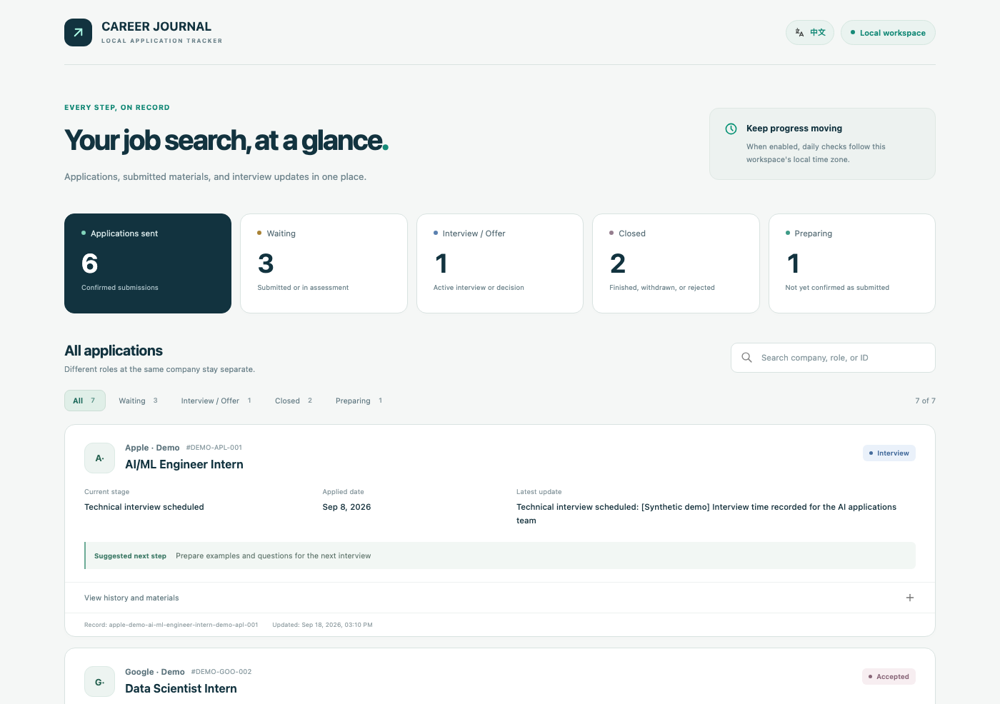

# CAREER JOURNAL

[简体中文](README.zh-CN.md) · [Getting Started](docs/getting-started.md) · [Changelog](CHANGELOG.md) · [Third-party notices](THIRD_PARTY_NOTICES.md)

A local-first job-search workspace for people and AI agents. CAREER JOURNAL keeps applications, recruiting evidence, submitted materials, and next actions together without sending the database to a hosted service.

## One-line setup

Paste this one sentence into **Codex, Claude Code, Cursor, or another repository-aware coding Agent**:

```text
Set up CAREER JOURNAL from https://github.com/haowenchen0811/career-journal by reading AGENTS.md and completing onboarding automatically.
```

The Agent handles cloning, setup, mailbox configuration, local time-zone detection, daily schedules, verification, and the first run. You only step in for an unavoidable login, authorization, or account choice. [Read the full setup guide →](docs/getting-started.md)

## Product preview



*Real browser capture with synthetic big-company examples. Company names are illustrative and do not represent real applications, outcomes, affiliations, or endorsements. No personal data is included.*

## What it does

- Tracks each application, status change, deadline, interview, and next action
- Reads a user-selected recruiting mailbox in read-only mode and turns messages into reviewable evidence
- Keeps generated drafts, verified files, and the exact submitted resume or cover letter distinct
- Runs locally with SQLite and a browser dashboard at `http://career-journal.localhost:<port>`
- Uses deterministic rules first, newly released **Jev** when available, and a configured structured LLM as fallback

## Built for Agent workflows

The repository tells a compatible Agent how to configure the workspace from end to end. It supports Codex and Claude Code as well as other coding Agents that can read repository instructions and create scheduled jobs. Resume and cover-letter work can route through the independent [CareerOps](https://github.com/career-ops-hq/career-ops) project plus CAREER JOURNAL's built-in U.S. resume rules.

## Documentation

- [Getting started and Agent setup](docs/getting-started.md)
- [Email, automation, CLI, backup, and upgrade guide](docs/getting-started.md#email-integration)
- [CareerOps bridge](docs/integrations/careerops-bridge.md)
- [Product requirements](docs/superpowers/specs/2026-09-19-job-search-ops-prd-design.en.md)
- [Release history](CHANGELOG.md)

## Open source

CAREER JOURNAL is released under the [MIT License](LICENSE). Third-party projects and preserved license texts are listed in [THIRD_PARTY_NOTICES.md](THIRD_PARTY_NOTICES.md) and [LICENSES](LICENSES).
