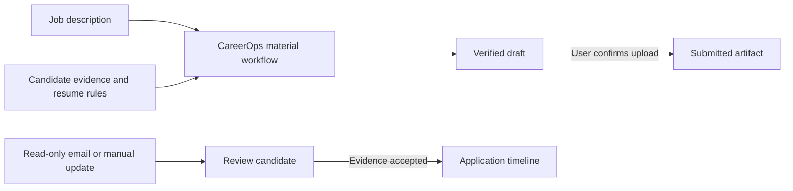

# CAREER JOURNAL

[English](README.md) | [简体中文](README.zh-CN.md)

CAREER JOURNAL is a local-first, evidence-driven application tracker for people and AI agents. It keeps roles, status events, recruiting email evidence, deadlines, and the exact material lifecycle in one SQLite database. A generated resume remains a draft until the exact uploaded file is confirmed.

This is an alpha release. Core tracking is usable without an email account, model key, CareerOps, or Jev access.

## What it does

- **Tracks every application:** company, role, current stage, dates, next actions, and a time-stamped event history
- **Separates facts from assumptions:** recruiting messages become review candidates before they can change an application status
- **Preserves the material lifecycle:** generated, verified, and actually submitted files remain distinct
- **Supports application materials:** combines CareerOps with built-in U.S. resume rules and optional personal rules
- **Runs locally:** stores records in SQLite and serves a loopback-only dashboard and JSON API
- **Prepares daily routines:** generates portable tasks for mail review, deadlines, consolidation, and backups in the computer's own time zone

## Product preview


*Real browser capture of the running dashboard with synthetic big-company examples. Company names are illustrative: they do not represent real applications, outcomes, affiliations, or endorsements. No personal data is included. The dashboard opens at `http://career-journal.localhost:<port>` and can be searched or filtered by application status.*

## Core workflows

### Track applications and decisions

Create a role, add evidence-backed events, record deadlines, and see the current stage without overwriting its history. Manual updates remain available even when no email or AI provider is configured.

### Review recruiting evidence

Read-only email evidence is attached to the relevant application and reviewed before it changes a status. Marketing mail is not treated as recruiting progress, and a received timestamp is not silently reused as an application date.

### Create and verify application materials

The CareerOps bridge can prepare a role-specific resume or cover letter. CAREER JOURNAL records whether a file is a draft, passed its rules, or was confirmed as the exact submitted artifact.

### Run daily checks

Portable automation definitions support mail review, deadline review, daily consolidation, and local backups. Each task has its own cursor, advances only after success, and stays quiet when nothing actionable changed.



## Who it is for

- **Codex users** who want a repository-aware Skill to configure and operate the workspace
- **API and CLI users** who want deterministic local workflows with an optional OpenAI-compatible model
- **Job seekers** who want application records, materials, and evidence together without handing their database to a hosted service

## Install

### Requirements

- Node.js 24 or newer
- Git for installation and updates
- Optional capabilities only when you use their workflows

### Quick Start

Clone and initialize a private local data directory:

```sh
git clone https://github.com/haowenchen0811/career-journal.git
cd career-journal
node ./bin/career-journal.mjs setup --home "$HOME/job-search" --skip-email
node ./bin/career-journal.mjs doctor --home "$HOME/job-search"
node ./bin/career-journal.mjs start --home "$HOME/job-search"
```

Use `node ./bin/career-journal.mjs ...` or the included `./career-journal ...` launcher from the clone. To install the bare `career-journal` command globally, run `npm link` with a Node.js installation that includes npm.

On first setup, CAREER JOURNAL detects the computer's IANA time zone. Later setup runs preserve the saved value unless the user explicitly passes `--timezone <IANA-zone>`.

The dashboard URL uses the reserved `.localhost` domain, so it needs no purchased domain, DNS record, or hosts-file change. The server still binds only to the local loopback interface and is not exposed to the LAN.

`--skip-email` is useful for a first trial. To use email evidence, configure an account explicitly; setup never assumes a school, work, or personal address:

```sh
node ./bin/career-journal.mjs email configure --home "$HOME/job-search" --provider manual-eml --address candidate@example.com
```

The commands below are executed by the documentation test against a new temporary home:

<!-- quickstart-smoke:start -->
```sh
$REPO/bin/career-journal.mjs setup --home $CAREER_JOURNAL_HOME --timezone UTC --skip-email
$REPO/bin/career-journal.mjs doctor --home $CAREER_JOURNAL_HOME
$REPO/bin/career-journal.mjs application add --home $CAREER_JOURNAL_HOME --company ExampleCorp --role DataScientist
$REPO/bin/career-journal.mjs event add --home $CAREER_JOURNAL_HOME --id examplecorp-datascientist --event-id example-submit --type application_submitted --title Submitted --status-after applied
$REPO/bin/career-journal.mjs application list --home $CAREER_JOURNAL_HOME --json
$REPO/bin/career-journal.mjs automation configure --home $CAREER_JOURNAL_HOME --task daily-consolidation --time 22:00 --enabled
```
<!-- quickstart-smoke:end -->

## Two Runtime Modes

### Codex-native

Open the cloned repository in Codex and ask it to set up CAREER JOURNAL. Codex discovers the repo-local `career-journal` Skill, runs `career-journal doctor`, and routes resume or cover-letter work through the separate `careerops-materials` Skill. The Skills name every dependency and preserve the difference between status evidence and submitted-artifact evidence.

### Local API and OpenAI-compatible models

Run `career-journal start --home <data-directory>` for the loopback dashboard and JSON API. Deterministic rules work without a model. An optional OpenAI-compatible provider can point to a hosted, local, or self-managed endpoint through `.career-journal/config.json`; credentials must be environment-variable references such as `env:MODEL_API_KEY`, never literal secrets.

## Common Commands

```sh
career-journal application add --home ~/job-search --company "Example" --role "Engineer"
career-journal event add --home ~/job-search --id example-engineer --type application_submitted --title "Application submitted" --status-after applied
career-journal email configure --home ~/job-search --provider manual-eml --address candidate@example.com
career-journal email import-eml --home ~/job-search --account manual-eml:candidate@example.com --id example-engineer --file message.eml
career-journal export json --home ~/job-search --output applications.json
career-journal start --home ~/job-search
```

Email access is optional and read-only. Setup never invents or defaults to a personal, work, or school address. The alpha supports explicit manual EML import; future OAuth adapters must preserve the same read-only boundary.

## Application Materials and CareerOps

[career-ops](https://github.com/career-ops-hq/career-ops) is an independent MIT-licensed project by Santiago Fernández de Valderrama. It is optional for core tracking and required for a verified resume or cover-letter workflow.

1. Install the pinned CareerOps version listed in `config/dependency-manifest.yml`
2. Configure its root during setup: `career-journal setup --home ~/job-search --careerops-root /path/to/career-ops`
3. Run `career-journal doctor --home ~/job-search`
4. In Codex, use the `careerops-materials` Skill; API clients can call `career-journal material prepare|verify --request request.json`

The alpha child-process adapter expects the configured CareerOps installation to expose the documented `career-journal-adapter.mjs` JSON bridge. If the bridge or pinned version is missing, material verification stays unavailable and any fallback must remain an **Unverified Draft**.

### Built-in and personal resume rules

CAREER JOURNAL ships the project author's reusable resume rules in [`config/material-rules/us-resume-default.md`](config/material-rules/us-resume-default.md). They add opinionated defaults that CareerOps does not impose: Education → Experience → Skills only, three bullets per employer, 11 point body text, no Projects or Summary, certification under Skills, concise achievement bullets, and a rule-by-rule final-PDF audit.

The built-in rules apply to U.S. English resumes and can be overridden by a user's explicit instruction. A user can also add a personal Skill or rule file without editing the repository:

```sh
career-journal setup --home ~/job-search --material-rules /path/to/personal-resume-skill/SKILL.md
```

The `careerops-materials` Skill loads the built-in defaults and every configured personal rule file, then records any overrides in the artifact audit. Resume-only rules never apply automatically to cover-letter prose.

## Email and Decision Providers

- **No email configured:** tracking, dashboard, exports, and manual updates still work
- **Read-only email:** store only provider/address metadata and secret references; importing an email creates a review candidate and never changes final status by itself
- **OpenAI-compatible provider:** optional structured fallback configured with base URL, model, and an environment-variable secret reference
- **Jev:** optional TypeSafe decision adapter. Keep `accessState: waitlisted` or `unavailable` until access exists; do not add a key you do not have. In shadow mode its decision is recorded but not applied. Rules and structured-model fallbacks remain available

## Daily Automations

Four portable tasks are included: `mail-sync`, `deadline-review`, `daily-consolidation`, and `local-backup`.

```sh
career-journal automation configure --home ~/job-search --task deadline-review --time 20:00 --enabled
career-journal automation configure --home ~/job-search --task daily-consolidation --time 22:00 --enabled
career-journal automation list --home ~/job-search
career-journal automation run --home ~/job-search --task deadline-review --dry-run
career-journal automation install --home ~/job-search --task deadline-review
```

When `--timezone` is omitted, automation uses the workspace time zone detected during setup. `install` prepares a platform-specific scheduler definition under `.career-journal/schedulers/`; it does not register it with the operating system. Review it, then load it with `launchctl` on macOS, `crontab` on Linux, or `schtasks` on Windows. Each task keeps its own cursor, advances it only after success, and stays quiet when nothing actionable changed. In this alpha, `local-backup` has an executable handler; tasks whose adapters are unavailable fail visibly and do not record a successful run.

If you manually registered a definition, remove the OS registration before deleting its file:

```sh
# macOS: use the exact plist path you loaded
launchctl bootout "gui/$(id -u)" "/path/to/io.career-journal.deadline-review.plist"
# Linux: remove the exact career-journal-deadline-review line from the current crontab
crontab -l | grep -v 'career-journal-deadline-review' | crontab -
# Windows
schtasks /Delete /TN "CareerJournal-deadline-review" /F
```

Then run `career-journal automation uninstall --home ~/job-search --task deadline-review` to remove the prepared definition. Its result deliberately distinguishes definition removal from OS scheduler removal.

## Data and Privacy

Data stays under the home you choose. `.career-journal/` contains configuration, SQLite data, immutable artifact copies, and prepared scheduler files. Exports omit secret references. Authentication links from imported mail are redacted. The project does not submit applications, send email, or contact recruiters.

## Update, Migration, Backup, and Uninstall

```sh
career-journal update --check
career-journal backup create --home ~/job-search --output ~/job-search-backup
career-journal migrate --home ~/job-search --dry-run
career-journal migrate --home ~/job-search --apply
```

Back up before an upgrade, pull a tagged release, run `career-journal update --check`, and apply only the reported migration. To uninstall, run `career-journal automation uninstall` for each installed task, preserve or export the selected data home, then delete the cloned repository. Delete the data home only when you also want to remove all local records and archived artifacts.

### Compatibility with v0.1.0-alpha.5 and earlier

The legacy `jobops` CLI, `.jobops/` data directory, `jobops-adapter.mjs` bridge name, and related scheduler identifiers are recognized only to upgrade installations created by v0.1.0-alpha.5 or earlier. A legacy config that explicitly names `jobops-adapter.mjs` remains supported; a new config never falls back to that bridge automatically. New installations and integrations must use `career-journal`, `.career-journal/`, `career-journal-adapter.mjs`, and CAREER JOURNAL scheduler identifiers.

Legacy automation rows keep their existing `jobops-*`, `io.job-search-ops.*`, and `JobSearchOps-*` identities when definitions are regenerated, so installing an upgrade does not create a parallel OS task. Because scheduler definitions contain the clone's absolute path, unload the existing registration, run `career-journal automation install` after moving or renaming the clone, and reload the regenerated definition under the same legacy identity. On Linux, replace the existing `jobops-*` crontab line with the regenerated line. `automation uninstall` removes prepared legacy and current files but does not unload an OS registration.

## Architecture

- `src/domain` owns application, event, status, and artifact rules
- `src/storage` owns versioned SQLite migrations
- `src/email`, `src/providers`, and `src/integrations` isolate optional services
- `src/automation` renders portable task definitions
- `src/server` serves the loopback dashboard and API
- `.agents/skills` provides Codex orchestration without copying third-party workflows

## Development and Releases

```sh
node --test
node scripts/check-release.mjs
```

Versions follow SemVer. Every release updates `VERSION`, `package.json`, and `CHANGELOG.md`; alpha tags use `v0.1.0-alpha.N`. Fresh-clone and previous-version upgrade smoke tests are release gates.

Public user documentation must ship in both English and Simplified Chinese. The release checker fails when the paired onboarding, attribution, or integration documentation is missing.

## Acknowledgements

CAREER JOURNAL integrates with and learns from third-party open-source work without claiming it as its own. See [THIRD_PARTY_NOTICES.md](THIRD_PARTY_NOTICES.md) and the preserved license texts in `LICENSES/`. The project name is distinct from the third-party career-ops trademark and does not imply endorsement.

## License

CAREER JOURNAL is released under the MIT License. See [LICENSE](LICENSE).
