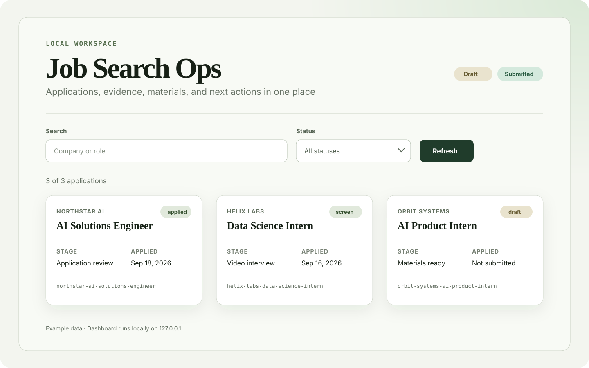
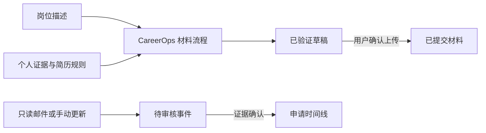

# Job Search Ops

[English](README.md) | [简体中文](README.zh-CN.md)

Job Search Ops 是一个本地优先、证据驱动的求职进度管理工具，同时面向求职者和 AI Agent。它用一个 SQLite 数据库统一保存岗位、状态事件、招聘邮件证据、截止日期和实际使用的申请材料。生成的简历会一直保持为草稿，直到用户明确确认已上传的准确文件。

当前是 alpha 版本。即使没有邮箱账户、模型密钥、CareerOps 或 Jev 访问权限，核心记录功能仍然可用。

## 它能做什么

- **记录每次投递：** 公司、岗位、当前阶段、日期、下一步行动和带时间戳的完整事件历史
- **区分事实与推断：** 招聘邮件先成为待审核事件，不能直接改变申请状态
- **保存材料生命周期：** 已生成、已验证和实际提交的文件分别记录
- **支持申请材料：** 将 CareerOps、内置美国简历规则和可选个人规则组合起来
- **在本地运行：** 使用 SQLite 保存记录，并提供仅监听本机环回地址的看板和 JSON API
- **准备每日流程：** 按当前电脑时区生成邮件检查、截止日期检查、信息整理和备份任务

## 产品界面



*界面使用虚构示例数据。看板在本机 `127.0.0.1` 运行，可以搜索并按申请状态筛选。*

## 核心工作流

### 记录申请与决策

创建岗位、添加有证据支持的事件、记录截止日期，并在保留历史的同时查看当前阶段。即使没有配置邮箱或 AI Provider，也可以手动更新。

### 审核招聘证据

只读邮件证据会先关联到对应岗位，并在改变状态前等待审核。人才营销邮件不会被当成求职进展，邮件接收时间也不会被擅自当成实际投递日期。

### 生成并验证申请材料

CareerOps 桥接可以准备针对岗位的简历或求职信。Job Search Ops 会分别记录文件是否只是草稿、是否通过规则检查，以及是否被确认成实际提交的版本。

### 执行每日检查

可移植的自动化定义覆盖邮件检查、截止日期检查、每日整理和本地备份。每个任务使用独立游标，只在成功后推进，没有需要处理的变化时保持安静。



## 适合谁

- **Codex 用户：** 希望通过能读取仓库的 Skill 完成配置和日常操作
- **API 与 CLI 用户：** 希望使用确定性的本地流程，并可选择 OpenAI-compatible 模型
- **求职者：** 希望把申请记录、材料和证据放在一起，又不想把数据库交给托管服务

## 安装

### 环境要求

- Node.js 24 或更新版本
- Git，用于安装和更新
- 只在使用对应流程时才需要配置可选能力

### 快速开始

克隆仓库，并初始化一个私有的本地数据目录：

```sh
git clone https://github.com/haowenchen0811/job-search-ops.git
cd job-search-ops
node ./bin/jobops.mjs setup --home "$HOME/job-search" --skip-email
node ./bin/jobops.mjs doctor --home "$HOME/job-search"
node ./bin/jobops.mjs start --home "$HOME/job-search"
```

可以在仓库中使用 `node ./bin/jobops.mjs ...` 或随项目提供的 `./jobops ...` 启动器。如果当前 Node.js 安装包含 npm，可运行 `npm link` 全局安装 `jobops` 命令。

首次初始化时，Job Search Ops 会自动读取当前电脑的 IANA 时区。之后重新运行 setup 会保留已保存的时区，除非用户明确传入 `--timezone <IANA-zone>`。

`--skip-email` 仅适合首次试用。如果你希望使用邮件证据，应当显式配置账户，系统不会默认使用学校、公司或个人邮箱：

```sh
node ./bin/jobops.mjs email configure --home "$HOME/job-search" --provider manual-eml --address candidate@example.com
```

## 两种运行模式

### Codex 原生模式

在 Codex 中打开克隆后的仓库，要求 Codex 配置 Job Search Ops。Codex 会发现仓库内的 `job-search-ops` Skill，运行 `jobops doctor`，并将简历或求职信任务交给独立的 `careerops-materials` Skill。这些 Skill 会明确标记依赖项，并区分“招聘状态证据”和“已提交材料证据”。

### 本地 API 与 OpenAI-compatible 模型

运行 `jobops start --home <数据目录>` 可启动只监听本机环回地址的看板和 JSON API。确定性规则不需要模型。可选的 OpenAI-compatible provider 可以在 `.jobops/config.json` 中指向托管、本地或自行管理的端点。凭据必须使用 `env:MODEL_API_KEY` 这类环境变量引用，不能写入真实密钥。

## 常用命令

```sh
jobops application add --home ~/job-search --company "Example" --role "Engineer"
jobops event add --home ~/job-search --id example-engineer --type application_submitted --title "Application submitted" --status-after applied
jobops email configure --home ~/job-search --provider manual-eml --address candidate@example.com
jobops email import-eml --home ~/job-search --account manual-eml:candidate@example.com --id example-engineer --file message.eml
jobops export json --home ~/job-search --output applications.json
jobops start --home ~/job-search
```

邮箱功能是可选的，而且必须只读。初始化过程不会推测或默认使用任何个人、公司或学校邮箱。当前 alpha 版本支持显式导入 EML 文件；未来的 OAuth 适配器也必须保持相同的只读边界。

## 申请材料与 CareerOps

[career-ops](https://github.com/career-ops-hq/career-ops) 是 Santiago Fernández de Valderrama 维护的独立 MIT 开源项目。它不是核心记录功能的必需项，但生成和验证简历或求职信时需要它。

1. 安装 `config/dependency-manifest.yml` 中锁定的 CareerOps 版本
2. 在初始化时设置根目录：`jobops setup --home ~/job-search --careerops-root /path/to/career-ops`
3. 运行 `jobops doctor --home ~/job-search`
4. 在 Codex 中使用 `careerops-materials` Skill；API 客户端可以调用 `jobops material prepare|verify --request request.json`

当前 alpha 版本的子进程适配器要求 CareerOps 安装目录暴露文档中规定的 `jobops-adapter.mjs` JSON 桥接。如果桥接或锁定版本缺失，材料验证将保持不可用，任何降级产物都必须标记为 **Unverified Draft**。

### 内置与个人简历规则

Job Search Ops 在 [`config/material-rules/us-resume-default.md`](config/material-rules/us-resume-default.zh-CN.md) 中内置了项目作者可复用的简历规则。这些是 CareerOps 本身没有强制的默认要求：只保留 Education → Experience → Skills、每家雇主三条 bullet、正文 11 磅、不使用 Projects 或 Summary、证书放入 Skills、使用精简成果句，并对最终 PDF 逐条检查。

内置规则适用于美国英文简历，用户的明确指令可以覆盖它们。用户也可以在不修改仓库的情况下添加自己的 Skill 或规则文件：

```sh
jobops setup --home ~/job-search --material-rules /path/to/personal-resume-skill/SKILL.md
```

`careerops-materials` Skill 会同时加载内置默认规则和所有已配置的个人规则文件，并在材料审核中记录覆盖项。简历专用的章节、bullet 和格式规则不会自动应用到求职信正文。

## 邮箱与决策 Provider

- **未配置邮箱：** 求职记录、看板、导出和手动更新仍可使用
- **只读邮箱：** 只保存 provider、邮箱地址元数据和密钥引用；导入邮件后只生成待审核事件，不会直接改变最终状态
- **OpenAI-compatible provider：** 可选的结构化降级方案，通过 base URL、模型名和环境变量密钥引用配置
- **Jev：** 可选的 TypeSafe 决策适配器。在真正获得访问权限之前，必须保持 `accessState: waitlisted` 或 `unavailable`，不应填写尚未拥有的密钥。在 shadow 模式中，决策只会被记录，不会被应用

## 每日自动化

项目提供四个可移植任务：`mail-sync`、`deadline-review`、`daily-consolidation` 和 `local-backup`。

```sh
jobops automation configure --home ~/job-search --task deadline-review --time 20:00 --enabled
jobops automation configure --home ~/job-search --task daily-consolidation --time 22:00 --enabled
jobops automation list --home ~/job-search
jobops automation run --home ~/job-search --task deadline-review --dry-run
jobops automation install --home ~/job-search --task deadline-review
```

未传入 `--timezone` 时，自动化会使用初始化时从电脑读取并保存的工作区时区。`install` 只会在 `.jobops/schedulers/` 中生成对应平台的调度定义，不会直接注册到操作系统。检查文件后，可分别使用 macOS 的 `launchctl`、Linux 的 `crontab` 或 Windows 的 `schtasks` 加载。每个任务保持自己的游标，只在成功后向前推进，没有可执行变化时保持安静。当前 alpha 中，`local-backup` 有真实的可执行处理器；其他缺少适配器的任务会明确失败，不会记录伪成功。

如果你手动注册了调度定义，应先删除操作系统中的注册，再删除本地定义文件：

```sh
# macOS：使用你实际加载的 plist 路径
launchctl bootout "gui/$(id -u)" "/path/to/io.job-search-ops.deadline-review.plist"
# Linux：从当前 crontab 中删除准确的 jobops-deadline-review 行
crontab -l | grep -v 'jobops-deadline-review' | crontab -
# Windows
schtasks /Delete /TN "JobSearchOps-deadline-review" /F
```

然后运行 `jobops automation uninstall --home ~/job-search --task deadline-review` 删除已生成的定义文件。返回结果会明确区分“已删除定义文件”和“已删除操作系统调度任务”。

## 数据与隐私

数据只保存在你选择的本地目录中。`.jobops/` 包含配置、SQLite 数据、不可变的申请材料副本和已生成的调度文件。导出不包含密钥引用，从邮件中识别出的身份验证链接会被脱敏。项目不会自动提交求职申请、发送邮件或联系招聘方。

## 更新、迁移、备份与卸载

```sh
jobops update --check
jobops backup create --home ~/job-search --output ~/job-search-backup
jobops migrate --home ~/job-search --dry-run
jobops migrate --home ~/job-search --apply
```

升级前先备份，然后拉取指定的版本标签，运行 `jobops update --check`，并且只应用命令实际报告的迁移。卸载时，先对每个已安装任务运行 `jobops automation uninstall`，保留或导出所选数据目录，再删除克隆的仓库。只有在你确实希望删除所有本地记录和归档材料时，才删除数据目录。

## 项目架构

- `src/domain` 管理申请、事件、状态和材料规则
- `src/storage` 管理版本化 SQLite 迁移
- `src/email`、`src/providers` 和 `src/integrations` 隔离可选服务
- `src/automation` 生成可移植的任务定义
- `src/server` 提供本地看板和 API
- `.agents/skills` 提供 Codex 编排能力，不复制第三方工作流

## 开发与发布

```sh
node --test
node scripts/check-release.mjs
```

版本号遵循 SemVer。每次发布都必须同步更新 `VERSION`、`package.json` 和 `CHANGELOG.md`；alpha 标签使用 `v0.1.0-alpha.N`。公开发布前必须通过 fresh-clone 和上一版本升级 smoke test。公开用户文档必须同时提供英文和简体中文版本。

## 致谢

Job Search Ops 会集成并借鉴第三方开源成果，但不会将其声称为自己的工作。详见 [第三方开源声明](THIRD_PARTY_NOTICES.zh-CN.md) 以及 `LICENSES/` 中保留的原始许可证文本。项目名称与第三方 career-ops 商标有明确区分，不代表对方为本项目背书。

## 许可证

Job Search Ops 使用 MIT License 发布，详见 [LICENSE](LICENSE)。
