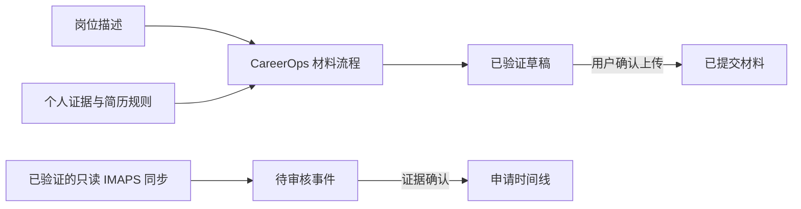

# CAREER JOURNAL

[English](README.md) | [简体中文](README.zh-CN.md)

CAREER JOURNAL 是一个本地优先、证据驱动的求职进度管理工具，同时面向求职者和 AI Agent。它用一个 SQLite 数据库统一保存岗位、状态事件、招聘邮件证据、下一步行动和实际使用的申请材料。生成的简历会一直保持为草稿，直到用户明确确认已上传的准确文件。

当前是 alpha 版本。一个完整的工作区必须有用户明确选择的一个只读求职邮箱，以及真实注册的四个每日任务。配置后，Jev 是主要语义决策引擎；明确场景先走确定性规则，Jev 不可用或结果不确定时进入人工复核，不再回退通用大模型。只有生成申请材料时才需要 CareerOps。

## 它能做什么

- **记录每次投递：** 公司、岗位、当前阶段、日期、下一步行动和带时间戳的完整事件历史
- **区分事实与推断：** 招聘邮件先成为待审核事件，不能直接改变申请状态
- **保存材料生命周期：** 已生成、已验证和实际提交的文件分别记录
- **支持申请材料：** 将 CareerOps、内置美国简历规则和可选个人规则组合起来
- **在本地运行：** 使用 SQLite 保存记录，并提供仅监听本机环回地址的看板和 JSON API
- **每日自动运行：** 按当前电脑检测到的时区检查求职邮件、活跃招聘阶段、申请汇总和本地备份

## 产品界面


*由真实运行的本地看板在浏览器中截取，使用大厂名称作为合成演示数据。公司名称只用于展示，不代表真实投递、结果、关联或背书；截图不含个人数据。看板通过 `http://career-journal.localhost:<port>` 打开，可以搜索并按申请状态筛选。*

## 核心工作流

### 记录申请与决策

创建岗位、添加有证据支持的事件、记录下一步行动，并在保留历史的同时查看当前阶段。仍然可以手动更新，但首次引导必须在邮箱和每日调度完成验证后才算结束。

### 审核招聘证据

内置 IMAPS 路径会通过 TLS 验证用户选择的邮箱，以只读方式打开邮箱，并在不设置已读标记的情况下导入邮件。匹配到的邮件会先成为待审核事件；人才营销邮件不会被当成求职进展，邮件接收时间也不会被擅自当成实际投递日期。宿主管理的连接器也可以导入结构化批次，但在独立验证器确认账号前，这些批次仍然只是自我声明。

### 生成并验证申请材料

CareerOps 桥接可以准备针对岗位的简历或求职信。CAREER JOURNAL 会分别记录文件是否只是草稿、是否通过规则检查，以及是否被确认成实际提交的版本。

### 执行每日检查

四个已注册任务分别负责邮件同步、活跃阶段检查、每日整理和本地备份。每个任务使用独立游标，只在成功后推进，没有需要处理的变化时保持安静。



## 适合谁

- **Codex 用户：** 希望通过能读取仓库的 Skill 完成配置和日常操作
- **API 与 CLI 用户：** 希望使用确定性本地流程与 Jev 类型化决策，避免用通用大模型做 prompt-and-parse 路由
- **求职者：** 希望把申请记录、材料和证据放在一起，又不想把数据库交给托管服务

## 安装

### 环境要求

- Node.js 24 或更新版本
- Git，用于安装和更新
- 一个真实的只读邮箱连接。内置且可独立验证的路径使用 TLS 上的 IMAPS；Codex 或 API 宿主连接器也可以导入邮件，但它提交的 JSON 本身只是自我声明
- 一个调度器。Codex 宿主能安全注入 IMAP 环境变量时可运行全部四项任务；本机操作系统安装目前覆盖另外三项任务
- 用户亲自选择的准确邮箱地址；CAREER JOURNAL 不会猜测应使用学校、工作还是个人邮箱

### 快速开始

#### Codex 配置

克隆项目，在 Codex 中打开克隆后的目录，然后发送下面这段话。仓库内的 Skill 会执行配置；如果不能验证邮箱或任一每日任务，它会停在未完成状态：

```sh
git clone https://github.com/haowenchen0811/career-journal.git
cd career-journal
```

如需使用 TypeSafe 权限，先把 TypeSafe AI 独立维护、使用 MIT 许可证的 Agent Skill 安装到当前克隆目录，并在提示中选择 Codex：

```sh
npx skills add typesafe-ai/skills --skill typesafe-ai
```

本仓库没有复制上游 Skill 源码；最新来源和许可证见 [`THIRD_PARTY_NOTICES.zh-CN.md`](THIRD_PARTY_NOTICES.zh-CN.md)。

```text
请初始化这个克隆目录中的 CAREER JOURNAL，数据目录使用 $HOME/job-search。请向我询问实际用于求职的邮箱地址、IMAPS 主机和用户名，以及保存 app password 或 provider credential 的环境变量名称。如果我已经获得 TypeSafe 权限，只询问保存 Jev API Key 的环境变量名称，并通过 --jev-secret-ref 配置；不要让我把任何真实密钥粘贴到 prompt 或配置文件中。修改 Jev 问题前先安装或读取官方 TypeSafe Agent Skill。检测当前电脑的 IANA 时区，并在该时区创建四个 ACTIVE 的每日 Codex heartbeat：20:00 mail-sync、20:15 deadline-review、22:00 daily-consolidation、23:00 local-backup。每个 heartbeat 返回真实 ID 后，先登记该 ID 取得 codexCommandLine，再更新同一个 heartbeat，把返回命令原样单独放在 prompt 的一行中，然后进行实时验证。分别触发一次已验证任务，再运行 doctor。只有邮箱和自动化检查都通过时，才能报告 onboarding 完成。
```

邮件 heartbeat 必须由 Codex 宿主的安全环境提供已配置的 IMAP 环境变量。变量值不得出现在 heartbeat prompt、`automation.toml`、CAREER JOURNAL 配置或 Git 中。如果宿主无法安全提供该变量，应停止并报告邮件调度和 onboarding 仍未完成。

#### CLI 与 API 宿主配置

把下面的邮箱信息改成你实际用于投递的账号。App password 或 provider credential 应保存在受保护环境或 secret store 中；setup 只保存 `env:VARIABLE` 引用：

```sh
export CAREER_JOURNAL_HOME="$HOME/job-search"
export JOB_EMAIL="你的真实邮箱"
export IMAP_HOST="邮箱服务商的 IMAPS 主机"
export IMAP_USER="$JOB_EMAIL"
# 通过受保护环境或 secret store 提供 CAREER_JOURNAL_IMAP_PASSWORD 和 TYPESAFE_API_KEY。
# Setup 只保存 env: 引用。
node ./bin/career-journal.mjs setup \
  --home "$CAREER_JOURNAL_HOME" \
  --email-provider imap \
  --email-address "$JOB_EMAIL" \
  --imap-host "$IMAP_HOST" \
  --imap-user "$IMAP_USER" \
  --secret-ref env:CAREER_JOURNAL_IMAP_PASSWORD \
  --jev-secret-ref env:TYPESAFE_API_KEY
node ./bin/career-journal.mjs email verify-imap \
  --home "$CAREER_JOURNAL_HOME" \
  --account "imap:$JOB_EMAIL"
```

Setup 会自动读取当前电脑的 IANA 时区，并在该时区中创建以下已启用任务记录：

| 本地时间 | 任务 | 作用 |
|---|---|---|
| 20:00 | `mail-sync` | 通过 TLS 验证并只读抓取所选邮箱，再导入招聘进展 |
| 20:15 | `deadline-review` | 检查测评、面试或 Offer 阶段的申请 |
| 22:00 | `daily-consolidation` | 生成每日申请汇总 |
| 23:00 | `local-backup` | 创建本地备份 |

数据库中的任务记录不会唤醒进程。下面命令对应 Codex 路径；本机和其他外部调度器见“每日自动化”。先创建四个真实 Codex 任务。每个任务必须处于 ACTIVE 状态，其保存定义必须包含正确的每日时间、检测到的时区和准确命令绑定。把下面四个 shell 变量替换成返回的 automation ID，再登记它们：

```sh
node ./bin/career-journal.mjs automation register-external --home "$CAREER_JOURNAL_HOME" --task mail-sync --driver codex --external-id "$MAIL_SYNC_ID"
node ./bin/career-journal.mjs automation register-external --home "$CAREER_JOURNAL_HOME" --task deadline-review --driver codex --external-id "$DEADLINE_REVIEW_ID"
node ./bin/career-journal.mjs automation register-external --home "$CAREER_JOURNAL_HOME" --task daily-consolidation --driver codex --external-id "$DAILY_CONSOLIDATION_ID"
node ./bin/career-journal.mjs automation register-external --home "$CAREER_JOURNAL_HOME" --task local-backup --driver codex --external-id "$LOCAL_BACKUP_ID"
```

每次登记都会输出 `codexCommandLine`。验证前，更新对应 heartbeat prompt，把返回字符串原样单独放在一行中，并在 prompt 中写明检测到的 IANA 时区。然后探测已保存任务，并分别触发一次：

```sh
node ./bin/career-journal.mjs automation verify --home "$CAREER_JOURNAL_HOME" --task mail-sync
node ./bin/career-journal.mjs automation verify --home "$CAREER_JOURNAL_HOME" --task deadline-review
node ./bin/career-journal.mjs automation verify --home "$CAREER_JOURNAL_HOME" --task daily-consolidation
node ./bin/career-journal.mjs automation verify --home "$CAREER_JOURNAL_HOME" --task local-backup
node ./bin/career-journal.mjs automation run --id career-journal-mail-sync --home "$CAREER_JOURNAL_HOME" --external-id "$MAIL_SYNC_ID"
node ./bin/career-journal.mjs automation run --id career-journal-deadline-review --home "$CAREER_JOURNAL_HOME" --external-id "$DEADLINE_REVIEW_ID"
node ./bin/career-journal.mjs automation run --id career-journal-daily-consolidation --home "$CAREER_JOURNAL_HOME" --external-id "$DAILY_CONSOLIDATION_ID"
node ./bin/career-journal.mjs automation run --id career-journal-local-backup --home "$CAREER_JOURNAL_HOME" --external-id "$LOCAL_BACKUP_ID"
node ./bin/career-journal.mjs doctor --home "$CAREER_JOURNAL_HOME"
node ./bin/career-journal.mjs start --home "$CAREER_JOURNAL_HOME"
```

IMAPS 邮件处理器会真实认证、用 `EXAMINE` 只读打开邮箱、通过 `BODY.PEEK[]` 抓取，并只在本地导入成功后推进 UID 游标。邮箱没有新邮件时，空结果也属于成功运行。只有当 `doctor` 中的邮箱和自动化检查都通过时，首次引导才算完成。邮箱通过要求过去 36 小时内有一次真实 IMAPS 认证和成功只读同步；自动化通过要求调度器实时探测成功，且四个已验证任务都有一次与其外部 ID 匹配的成功运行。之后重新运行 setup 会保留已保存的时间、通知策略、任务状态、注册信息和时区，除非用户明确修改。

可以在仓库中使用 `node ./bin/career-journal.mjs ...` 或随项目提供的 `./career-journal ...` 启动器。如果当前 Node.js 安装包含 npm，可运行 `npm link` 全局安装 `career-journal` 命令。

看板使用专门为本机保留的 `.localhost` 域名，不需要购买域名、配置 DNS 或修改 hosts 文件。服务底层仍然只监听本机环回接口，不会开放到局域网。

## 两种运行模式

### Codex 原生模式

在 Codex 中打开克隆后的仓库，并使用快速开始中的初始化提示。Codex 会发现仓库内的 `career-journal` Skill，询问准确邮箱而不是自行猜测，配置实时 IMAPS，在电脑检测到的时区创建四个真实 ACTIVE heartbeat，并把每个返回的 automation ID 绑定到准确运行命令。然后它会回读实际 Codex 自动化定义，分别触发一次已验证任务，只在 `doctor` 通过后结束配置。宿主必须把命名的 IMAP 环境变量安全注入邮件任务，不能把变量值复制进 prompt。Codex 邮箱连接器仍可提供只读批次，但连接器自行编写的 JSON 不是独立账户证明。简历和求职信任务会路由到独立的 `careerops-materials` Skill。

### 本地 API 与 Jev 决策

运行 `career-journal start --home <data-directory>` 启动本地看板和 JSON API。通用路径使用内置 IMAPS 客户端，以及能够把命名的 IMAP 和 Jev 环境变量安全提供给 `mail-sync` 的调度器。macOS、Linux 或 Windows 上的 `automation install` 可以安装并探测另外三项任务；当前 alpha 会明确拒绝原生安装 `mail-sync`，因为生成定义尚未提供安全且跨平台的 secret provider。API 宿主也可以提交结构化只读批次，但在邮箱健康检查通过前，还需要单独的实时验证适配器。明确场景先走免费的确定性规则，模糊邮件交给 Jev；返回格式错误或置信度不足时进入人工复核。招聘决策不会再回退已配置的 OpenAI-compatible Provider。

## 邮箱集成

完整的内置路径是 `--email-provider imap`。它使用证书校验后的 TLS 连接，通过 `env:VARIABLE` 引用取得凭据，以只读方式打开邮箱，在不设置 Seen 标记的情况下抓取，并使用 `UIDVALIDITY` 与 UID 作为可恢复游标：

```sh
node ./bin/career-journal.mjs email verify-imap --home "$CAREER_JOURNAL_HOME" --account "imap:$JOB_EMAIL"
node ./bin/career-journal.mjs email sync-imap --home "$CAREER_JOURNAL_HOME" --account "imap:$JOB_EMAIL" --external-task-id "$MAIL_SYNC_ID"
```

定时运行使用稳定任务 ID：`automation run --id career-journal-mail-sync --home <absolute-home> --external-id <registered-id>`。它调用同一个直接 IMAPS 同步。每次真实同步都会刷新验证。调度进程必须收到 `secret-ref` 指定的环境变量；变量值始终留在 CAREER JOURNAL 之外，不能放入 heartbeat prompt 或操作系统调度定义。凭据不会由 `email list` 返回、写入批次文件或复制进备份。

`--email-provider host` 表示 Codex、API Client 或其他宿主负责邮箱认证和只读获取。CAREER JOURNAL 会保存 Provider 名称、邮箱地址、连接器标签、游标和规范化证据，不会保存邮箱密码、OAuth Token、会话 Cookie 或连接器凭据。宿主批次始终是**自我声明**：可以导入邮件，但不能单独证明所写邮箱真实存在，也不能让 `doctor` 通过。宿主集成还需要单独的实时验证适配器；当前 alpha 提供 IMAPS 作为通用验证器。

宿主将有大小上限的 JSON 批次写入私有临时文件，再调用本地导入器：

```json
{
  "accountId": "host:candidate@example.com",
  "connector": "gmail",
  "readOnly": true,
  "beforeCursor": null,
  "afterCursor": "provider-cursor-after-this-page",
  "runId": "unique-provider-run-id",
  "fetchedAt": "2026-09-19T01:05:00Z",
  "externalTaskId": "the-registered-mail-sync-id",
  "messages": [
    {
      "sourceId": "provider-message-id",
      "from": "recruiting@example.com",
      "to": "candidate@example.com",
      "subject": "Application update",
      "sentAt": "2026-09-19T01:00:00Z",
      "body": "Message text",
      "applicationId": "optional-known-application-id"
    }
  ]
}
```

```sh
career-journal email sync-host --home ~/job-search --account host:candidate@example.com --file /private/path/mail-batch.json
```

`accountId`、`connector` 和 `externalTaskId` 必须分别与已配置邮箱和当前 mail 任务注册一致。`beforeCursor` 必须等于 CAREER JOURNAL 保存的游标，`afterCursor` 是本次获取后的 Provider 游标，`runId` 必须对本次获取唯一。宿主应使用小幅重叠的时间窗口，并按 Provider 邮件 ID 去重。CAREER JOURNAL 会拒绝过期或乱序批次，在一个事务中写入全部邮件证据与两个游标；竞争失败或处理中失败的批次不会留下部分 trace。`docs/examples/initial-mail-sync.json` 是合成测试数据，不是真实 connector 的证明。手动 EML 只是导入单封邮件的临时备用方式，不能提供每日邮箱覆盖，也不能让 `doctor` 通过：

```sh
career-journal email configure --home ~/job-search --provider manual-eml --address "$JOB_EMAIL"
career-journal email import-eml --home ~/job-search --account "manual-eml:$JOB_EMAIL" --id example-engineer --file message.eml
```

## 常用命令

```sh
career-journal application add --home ~/job-search --company "Example" --role "Engineer"
career-journal event add --home ~/job-search --id example-engineer --type application_submitted --title "Application submitted" --status-after applied
career-journal email list --home ~/job-search
career-journal automation list --home ~/job-search
career-journal export json --home ~/job-search --output applications.json
career-journal start --home ~/job-search
```

## 申请材料与 CareerOps

[career-ops](https://github.com/career-ops-hq/career-ops) 是 Santiago Fernández de Valderrama 独立开发的 MIT 许可开源项目。它对于基础记录是可选依赖，对于经验证的简历或求职信流程则是必需依赖。

1. 安装 `config/dependency-manifest.yml` 中锁定版本的 CareerOps
2. 在 setup 时配置根目录：`career-journal setup --home ~/job-search --careerops-root /path/to/career-ops`
3. 运行 `career-journal doctor --home ~/job-search`
4. Codex 中使用 `careerops-materials` Skill；API Client 可调用 `career-journal material prepare|verify --request request.json`

当前 alpha 版本的子进程适配器要求已配置的 CareerOps 安装提供文档中定义的 `career-journal-adapter.mjs` JSON 桥接。如果桥接或锁定版本缺失，材料验证会保持不可用，任何降级输出都必须保持为 **Unverified Draft**。

### 内置与个人简历规则

CAREER JOURNAL 会在 [`config/material-rules/us-resume-default.md`](config/material-rules/us-resume-default.md) 中提供项目作者可复用的简历规则。它们补充了 CareerOps 不会强制的偏好：只保留 Education → Experience → Skills，每个雇主三条 bullet，正文 11pt，不使用 Projects 或 Summary，证书放在 Skills 中，使用精简成就表达，并对最终 PDF 执行逐条检查。

这些内置规则适用于美式英文简历，用户可以用明确指令覆盖。也可以在不修改仓库的情况下添加个人 Skill 或规则文件：

```sh
career-journal setup --home ~/job-search --material-rules /path/to/personal-resume-skill/SKILL.md
```

`careerops-materials` Skill 会读取内置默认规则和所有已配置个人规则，并在材料审计中记录任何覆盖。仅适用于简历的规则不会自动应用到求职信正文。

## 决策 Provider

- **确定性规则：** 先处理明确且可审查的场景，避免不必要的 API 费用
- **Jev：** 模糊招聘邮件的主要语义分类器。使用 `--jev-secret-ref env:TYPESAFE_API_KEY` 配置；v1 适配器发送 `state` 与一个类型化 Choice 问题，并验证返回选项和置信度
- **人工复核：** 接收 Jev 不可用、格式错误、shadow 或低于阈值的结果。招聘决策链不会调用通用大模型

环境中存在 Key 后，可以显式运行 `npm run test:jev-live`，执行三次请求的契约与分类 smoke test。它只输出分类、置信度和 token 用量，不会打印 Key。该真实测试不会加入普通离线测试或每日自动化，因此不会在后台静默消耗额度。

## 每日自动化

Setup 默认按电脑当前检测到的时区配置 `mail-sync` 20:00、`deadline-review` 20:15、`daily-consolidation` 22:00 和 `local-backup` 23:00。可以在 setup 时或通过 `automation configure` 明确修改这些时间。

真正唤醒进程的调度器位于 CAREER JOURNAL 之外。Codex 自动化、服务调度器或 API 宿主必须真正创建每个任务。`register-external` 只会在任务创建成功后记录待验证声明，它本身既不会创建任务，也不会完成验证。不要注册占位 ID。

- `mail-sync`：在能够安全提供 IMAP 环境变量的宿主中运行 `automation run --id career-journal-mail-sync --home <absolute-home> --external-id <registered-id>`
- `deadline-review`：运行 `automation run --id career-journal-deadline-review --home <absolute-home> --external-id <registered-id>`
- `daily-consolidation`：运行 `automation run --id career-journal-daily-consolidation --home <absolute-home> --external-id <registered-id>`
- `local-backup`：运行 `automation run --id career-journal-local-backup --home <absolute-home> --external-id <registered-id>`

每个任务保持独立游标，只在处理器完成后记录成功。部分导入或失败批次不会推进邮件游标。

### Codex heartbeat 登记

先创建 heartbeat 并保留返回的 automation ID。使用 `codex` driver 登记该 ID；命令会返回 `codexCommandLine`，其中包含绝对 Node 可执行文件、仓库 CLI、数据目录、任务 ID 和外部 ID。更新同一个 heartbeat，把返回的字符串**原样单独放在 prompt 的一行中**，并写明检测到的 IANA 时区；不要自行重写或缩短命令。`mail-sync` prompt 可以写出 `CAREER_JOURNAL_IMAP_PASSWORD` 这个变量名，但不能包含变量值。运行 `automation verify`，再让 heartbeat 用那一行准确命令执行一次。验证会读取 `~/.codex/automations/<id>/automation.toml`，并要求 ACTIVE 每日任务的时间、时区、可执行文件、CLI、任务 ID、数据目录和外部 ID 全部匹配。待验证声明、截图、相似命令或验证前直接运行都不能通过门禁。

### 本机调度器

`automation install` 会安装并实时探测 macOS launchd、Linux 当前用户 crontab 或 Windows Task Scheduler。alpha.6 支持原生安装 `deadline-review`、`daily-consolidation` 和 `local-backup`：

```sh
node ./bin/career-journal.mjs automation install --home "$CAREER_JOURNAL_HOME" --task deadline-review
node ./bin/career-journal.mjs automation install --home "$CAREER_JOURNAL_HOME" --task daily-consolidation
node ./bin/career-journal.mjs automation install --home "$CAREER_JOURNAL_HOME" --task local-backup
node ./bin/career-journal.mjs automation list --home "$CAREER_JOURNAL_HOME"
```

分别触发一次时，使用 `automation list` 中已经验证的 `registration.externalId`。新安装在 macOS 使用 `io.career-journal.<task>`，Linux 使用 `career-journal-<task>`，Windows 使用 `CareerJournal-<task>`。alpha.6 会主动阻止原生安装 `mail-sync`：请使用 Codex 或其他可信外部调度器，在不把密钥写入任务定义的前提下安全注入已配置环境变量。宿主管理的邮箱还需要独立实时验证器。四项任务都完成实时探测并使用匹配外部 ID 运行一次后，再运行 `doctor`。

如果你手动注册了调度定义，应先删除操作系统中的注册，再删除本地定义文件：

```sh
# macOS：使用你实际加载的 plist 路径
launchctl bootout "gui/$(id -u)" "/path/to/io.career-journal.deadline-review.plist"
# Linux：从当前 crontab 中删除准确的 career-journal-deadline-review 行
crontab -l | grep -v 'career-journal-deadline-review' | crontab -
# Windows
schtasks /Delete /TN "CareerJournal-deadline-review" /F
```

然后运行 `career-journal automation uninstall --home ~/job-search --task deadline-review` 删除已生成的定义文件。返回结果会明确区分“已删除定义文件”和“已删除操作系统调度任务”。

## 数据与隐私

数据只保存在你选择的本地目录中。`.career-journal/` 包含配置、SQLite 数据、不可变申请材料副本、报告、备份和已生成的调度文件。导出不包含密钥引用，从邮件中识别出的身份验证链接会被脱敏。应将临时结构化批次放在私有路径中，并按本地保留策略删除。项目不会自动提交求职申请、发送邮件或联系招聘方。

`backup create` 会写入脱敏配置、SQLite 数据库、清单和 `artifacts-index.json`。由于申请材料可能包含凭据或其他私密内容，默认备份不复制材料原文件；请在你自己控制的存储中单独保留原件。备份副本还会清除邮箱验证、同步运行健康状态和调度注册证明，因此恢复后的工作区必须重新验证邮箱和调度任务。

## 更新、迁移、备份与卸载

```sh
career-journal update --check
career-journal backup create --home ~/job-search --output ~/job-search-backup
career-journal migrate --home ~/job-search --dry-run
career-journal migrate --home ~/job-search --apply
```

升级前先备份，然后拉取指定的版本标签，运行 `career-journal update --check`，并且只应用命令实际报告的迁移。默认备份保留材料索引与哈希，不包含原文件。卸载时，先删除四个外部调度任务，对已生成定义运行 `career-journal automation uninstall`，保留或导出所选数据目录，再删除克隆的仓库。只有在你确实希望删除所有本地记录和归档材料时，才删除数据目录。

### 兼容 v0.1.0-alpha.5 及更早版本

旧的 `jobops` CLI、`.jobops/` 数据目录、`jobops-adapter.mjs` 桥接名和相关调度标识只用于升级 v0.1.0-alpha.5 及更早版本创建的安装。显式指定 `jobops-adapter.mjs` 的旧配置仍受支持；新配置不会自动回退到旧桥接。新安装和新集成必须使用 `career-journal`、`.career-journal/`、`career-journal-adapter.mjs` 和 CAREER JOURNAL 调度标识。

重新生成定义时，旧自动化会继续使用原有的 `jobops-*`、`io.job-search-ops.*` 和 `JobSearchOps-*` 标识，因此升级安装不会创建并行的系统任务。调度定义包含克隆目录的绝对路径；移动或重命名克隆目录后，应先卸载现有系统注册，运行 `career-journal automation install`，再以相同的旧标识重新加载生成的定义。Linux 用户应使用重新生成的内容替换已有的 `jobops-*` crontab 行。`automation uninstall` 会删除新旧本地定义文件，但不会卸载操作系统中的注册。

## 项目架构

- `src/domain` 管理申请、事件、状态和材料规则
- `src/storage` 管理版本化 SQLite 迁移
- `src/email`、`src/providers` 和 `src/integrations` 隔离由宿主管理的服务
- `src/automation` 保存调度、实时探测调度器定义、运行本地处理器，并记录已验证注册与已观测的匹配运行
- `src/server` 提供本地看板和 API
- `.agents/skills` 提供 Codex 编排能力，不复制第三方工作流

## 开发与发布

```sh
node --test
node scripts/check-release.mjs
```

版本号遵循 SemVer。每次发布都必须同步更新 `VERSION`、`package.json` 和 `CHANGELOG.md`；alpha 标签使用 `v0.1.0-alpha.N`。公开发布前必须通过 fresh-clone 和上一版本升级 smoke test。公开用户文档必须同时提供英文和简体中文版本。

### 项目参考文档

- 仓库 Skill：[English](.agents/skills/career-journal/SKILL.md) · [简体中文](.agents/skills/career-journal/SKILL.zh-CN.md)
- 产品需求文档：[English](docs/superpowers/specs/2026-09-19-job-search-ops-prd-design.en.md) · [简体中文](docs/superpowers/specs/2026-09-19-job-search-ops-prd-design.md)

## 致谢

CAREER JOURNAL 会集成并借鉴第三方开源成果，但不会将其声称为自己的工作。详见 [第三方开源声明](THIRD_PARTY_NOTICES.zh-CN.md) 以及 `LICENSES/` 中保留的原始许可证文本。项目名称与第三方 career-ops 商标有明确区分，不代表对方为本项目背书。

## 许可证

CAREER JOURNAL 使用 MIT License 发布，详见 [LICENSE](LICENSE)。
