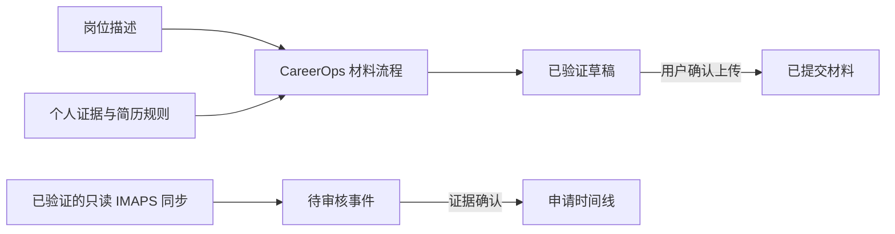

# CAREER JOURNAL

[English](README.md) | [简体中文](README.zh-CN.md)

CAREER JOURNAL 是一款在本地运行的求职申请管理工具，既可以由求职者直接使用，也可以交给 AI Agent 操作。它把岗位、申请阶段、招聘邮件、下一步行动和实际投递的材料统一保存在一个 SQLite 数据库中。系统生成的简历和求职信默认只是草稿；只有用户明确确认自己上传了哪个文件，系统才会把它记录为实际投递版本。

当前版本仍处于 alpha 阶段。要让 `doctor` 判定首次配置已经完成，需要连接一个由用户自己选择的求职邮箱并验证只读同步，同时创建并验证两个每日任务：20:00 同步招聘邮件，20:15 检查正在进行中的申请和临近事项。当天汇总不属于 CAREER JOURNAL 的默认流程；备份只在用户需要时按需执行。

这里的“实际创建”指调度器真的会在指定时间执行命令。`setup` 写入数据库的只是任务设置，不会自己在晚上唤醒程序；真正负责定时运行的是 Codex heartbeat、macOS `launchd`、Linux `cron`、Windows Task Scheduler，或其他外部调度服务。

CAREER JOURNAL 已经支持 TypeSafe AI 于 2026 年 9 月 15 日开放 early access 的新产品 Jev。系统先用固定规则处理含义明确的邮件；配置 Jev 后，Jev 是首选语义判断引擎。没有 Jev，或者 Jev 不可用、处于 `shadow` 模式、返回格式错误、结果未知或置信度不足时，系统会自动改用用户配置的 OpenAI-compatible 大语言模型。两者都无法给出可靠判断时，邮件才进入人工复核。所有模型输出都只是待审核候选，不会直接修改申请状态。详情见 [TypeSafe AI 的 Jev 发布说明](https://typesafe.ai/blog/introducing-system-one-models-and-jev)。CareerOps 只在生成或检查简历、求职信时使用。

## 它能做什么

- **记录完整的投递过程：** 保存公司、岗位、当前阶段、日期、下一步行动和每一次带时间戳的状态变化
- **把邮件证据与状态更新分开：** 新邮件先进入待审核列表，确认后才会改变申请状态
- **区分材料所处阶段：** 分别记录刚生成的草稿、通过规则检查的文件和用户确认实际提交的版本
- **生成求职材料：** 通过 CareerOps 结合内置美式简历规则和用户自己的补充规则
- **数据保存在本地：** 使用 SQLite 存储记录，并提供只允许本机访问的看板和 JSON API
- **按本机时区每天运行：** 自动同步招聘邮件，并检查正在进行中的申请和临近事项

## 产品界面


*这张图截自实际运行的本地看板，其中的公司、岗位和申请记录都是虚构的演示数据。出现的公司名称只用于展示界面，不代表真实投递、求职结果、合作关系或官方背书；截图不含个人数据。启动服务后，通过 `http://career-journal.localhost:<port>` 打开看板，可以搜索岗位并按申请状态筛选。*

## 核心工作流

### 记录申请与决策

创建岗位后，可以添加有依据的进展事件和下一步行动。每次变化都会留在时间线中，因此既能看到当前阶段，也能回顾之前发生过什么。记录可以手动维护，但首次配置只有在邮箱和每日自动任务都通过验证后才算完成。

### 审核招聘证据

内置的 IMAPS 方式通过 TLS 加密连接用户选择的邮箱，以只读模式获取邮件，也不会把邮件标记为已读。匹配到的招聘邮件会先进入待审核列表，不会立刻修改申请状态；人才营销邮件不会被当成求职进展，系统也不会把收件时间擅自当成实际投递日期。

Codex、API 客户端或其他运行环境也可以批量导入结构化邮件数据。但这类 JSON 只能说明发送方声称数据来自某个邮箱；在独立验证器确认账号和只读连接之前，它不能单独证明邮箱可用。

### 生成并验证申请材料

通过 CareerOps 可以为目标岗位生成和检查简历或求职信。CAREER JOURNAL 会分别记录文件是否仍是草稿、是否通过规则检查，以及用户是否确认它就是实际提交的版本。

### 执行每日检查

两个每日任务分别负责邮件同步，以及申请与截止事项检查。每个任务都有自己的处理位置记录，只有成功完成后才会向前推进；没有需要用户处理的新变化时，任务保持安静。



## 适合谁

- **Codex 用户：** 希望让仓库内的 Skill 协助完成初始化和日常维护
- **API 与 CLI 用户：** 希望使用可检查的本地流程，同时获得新发布的 Jev 支持；没有 Jev 账户时，也可以使用自己配置的大语言模型
- **求职者：** 希望把申请记录、材料和邮件证据放在一起，同时把数据库留在自己的电脑上

## 安装

### 环境要求

- Node.js 24 或更新版本
- Git，用于安装和更新
- 一个由用户选择、能够实际完成只读连接的求职邮箱。内置验证方式使用 TLS 加密的 IMAPS；Codex 或 API 连接器也可以导入邮件，但单独一份 JSON 不能证明邮箱已经连接成功
- 一个能够按时执行命令的调度器。Codex 能安全提供 IMAP 环境变量时可以运行两个必需任务；当前版本的本机操作系统安装支持 `deadline-review`
- 准确的邮箱地址。CAREER JOURNAL 不会替用户猜测应该使用学校邮箱、工作邮箱还是个人邮箱

### 快速开始

#### 由 Agent 自动配置：任选一种入口

下面两种方式二选一即可。无论选择哪一种，后续的下载、Skill 安装、时区检测、项目配置、定时任务创建、验证和首次运行都由 Agent 完成。用户只需提供 Agent 无法安全推断的账号信息、授权或环境变量名称。

##### 方式一：只把 GitHub 地址交给 Agent

把下面这段发给编程 Agent：

```text
请帮我自动安装并完成这个项目的首次配置：
https://github.com/haowenchen0811/career-journal
```

仓库根目录的 [`AGENTS.md`](AGENTS.md) 会要求 Agent 自动克隆或打开项目、读取 CAREER JOURNAL Skill、只询问必要的账号信息、创建两个真实定时任务、完成验证并运行 `doctor`。

##### 方式二：复制完整安装提示词

如果 Agent 不会主动读取仓库说明，复制下面的完整提示词：

```text
请从 https://github.com/haowenchen0811/career-journal 安装 CAREER JOURNAL，并替我完成首次配置。如果本地还没有这个仓库，请先克隆，再进入克隆后的目录工作。开始配置前，先读取 AGENTS.md 和 .agents/skills/career-journal/SKILL.md。

安装 TypeSafe Skill。如果你使用 Claude Code，运行 `claude plugin marketplace add typesafe-ai/skills`，再运行 `claude plugin install typesafe@typesafe-ai`；如果你使用其他 Agent，运行 `npx skills add typesafe-ai/skills --skill typesafe-ai`，并选择当前 Agent。只使用其中一种安装方式。也可以直接读取 https://github.com/typesafe-ai/skills/blob/main/skills/typesafe-ai/SKILL.md，原始文件地址是 https://raw.githubusercontent.com/typesafe-ai/skills/main/skills/typesafe-ai/SKILL.md。之后在这个项目中使用 TypeSafe Skill。

不要让我手动执行安装或配置命令。只询问你无法安全推断或代替完成的信息与授权：我的真实求职邮箱、必要的 IMAPS 配置、保存凭据的环境变量名称，以及我是否已经获得 TypeSafe Jev 权限。不要让我把密码或 API Key 粘贴进对话、配置文件、日志或 Git。

检测这台电脑的 IANA 时区。有 Jev 权限时配置 Jev；没有时配置我的 OpenAI-compatible 大语言模型。只创建两个 ACTIVE 每日任务：20:00 的 mail-sync 和 20:15 的 deadline-review。登记真实 automation ID，把返回的 codexCommandLine 原样放进同一个定时任务，检查实际保存的任务定义，并分别运行一次。最后运行 career-journal doctor；只有真实邮箱和两个必需任务都通过后，才能告诉我首次配置已完成。不要创建 daily-consolidation，也不要安排每日 local-backup。备份只在我明确要求时按需执行。
```

CAREER JOURNAL 不会要求 Agent 把真实密钥写入提示词或仓库。如果邮箱或服务商要求登录、2FA 或明确授权，Agent 只在这个无法替代的环节暂停，用户完成后继续自动执行。

#### 使用 CLI 或 API 配置

把下面的邮箱信息替换成实际用于求职的账号。应用专用密码或服务凭据应放在受保护的环境变量或密钥管理工具中；`setup` 只保存 `env:VARIABLE` 形式的引用，不保存凭据本身：

```sh
export CAREER_JOURNAL_HOME="$HOME/job-search"
export JOB_EMAIL="你的真实邮箱"
export IMAP_HOST="邮箱服务商的 IMAPS 主机"
export IMAP_USER="$JOB_EMAIL"
# 通过受保护环境或 secret store 提供 CAREER_JOURNAL_IMAP_PASSWORD 和 TYPESAFE_API_KEY。
# Setup 只保存 env: 引用。
node ./bin/career-journal.mjs setup \
  --home "$CAREER_JOURNAL_HOME" \
  --email-provider imap \
  --email-address "$JOB_EMAIL" \
  --imap-host "$IMAP_HOST" \
  --imap-user "$IMAP_USER" \
  --secret-ref env:CAREER_JOURNAL_IMAP_PASSWORD \
  --jev-secret-ref env:TYPESAFE_API_KEY
node ./bin/career-journal.mjs email verify-imap \
  --home "$CAREER_JOURNAL_HOME" \
  --account "imap:$JOB_EMAIL"
```

如果没有 Jev 权限，去掉 `--jev-secret-ref`，改为配置默认的大语言模型判断路径。API Key 仍只保存在环境变量中：

```sh
node ./bin/career-journal.mjs setup \
  --home "$CAREER_JOURNAL_HOME" \
  --model-provider openai-compatible \
  --model-base-url "$MODEL_BASE_URL" \
  --model-name "$MODEL_NAME" \
  --model-secret-ref env:MODEL_API_KEY
```

`setup` 会读取当前电脑的 IANA 时区，并在数据库中写入以下两项已启用的任务设置：

| 本地时间 | 任务 | 作用 |
|---|---|---|
| 20:00 | `mail-sync` | 通过 TLS 验证并只读抓取所选邮箱，再导入招聘进展 |
| 20:15 | `deadline-review` | 检查测评、面试或 Offer 阶段的申请 |

这些数据库记录不会自动执行。使用 Codex 时，还要真正创建两个 heartbeat，并让每个 heartbeat 在正确的本地时间运行对应命令；使用本机或其他调度器时，请参阅“每日自动化”。Codex 中的两个任务都必须处于 `ACTIVE` 状态，保存的定义要包含正确的每日时间、检测到的时区和完整命令。创建后，把下面两个 shell 变量替换成 Codex 返回的 automation ID，再把它们登记到 CAREER JOURNAL：

```sh
node ./bin/career-journal.mjs automation register-external --home "$CAREER_JOURNAL_HOME" --task mail-sync --driver codex --external-id "$MAIL_SYNC_ID"
node ./bin/career-journal.mjs automation register-external --home "$CAREER_JOURNAL_HOME" --task deadline-review --driver codex --external-id "$DEADLINE_REVIEW_ID"
```

每次登记都会输出 `codexCommandLine`。验证前，编辑对应 heartbeat 的 prompt，把这条字符串完整地单独放在一行中，并写明检测到的 IANA 时区。随后检查 Codex 中实际保存的任务定义，再分别运行一次：

```sh
node ./bin/career-journal.mjs automation verify --home "$CAREER_JOURNAL_HOME" --task mail-sync
node ./bin/career-journal.mjs automation verify --home "$CAREER_JOURNAL_HOME" --task deadline-review
node ./bin/career-journal.mjs automation run --id career-journal-mail-sync --home "$CAREER_JOURNAL_HOME" --external-id "$MAIL_SYNC_ID"
node ./bin/career-journal.mjs automation run --id career-journal-deadline-review --home "$CAREER_JOURNAL_HOME" --external-id "$DEADLINE_REVIEW_ID"
node ./bin/career-journal.mjs doctor --home "$CAREER_JOURNAL_HOME"
node ./bin/career-journal.mjs start --home "$CAREER_JOURNAL_HOME"
```

IMAPS 邮件处理器会先完成账号认证，再用 `EXAMINE` 以只读方式打开邮箱，并通过 `BODY.PEEK[]` 获取邮件。只有邮件成功写入本地后，系统才会更新 UID 游标；如果邮箱没有新邮件，空结果仍算一次成功同步。

只有 `doctor` 同时通过邮箱和自动化检查，首次配置才算完成。邮箱检查要求最近 36 小时内至少有一次真实的 IMAPS 认证和成功只读同步；自动化检查要求系统能够读取调度器中实际保存的任务定义，而且两个必需任务都曾使用各自登记的外部 ID 成功运行一次。以后再次执行 `setup` 时，已保存的时间、通知策略、启用状态、登记信息和时区都会保留，除非用户明确要求修改。

可以在仓库中使用 `node ./bin/career-journal.mjs ...` 或随项目提供的 `./career-journal ...` 启动器。如果当前 Node.js 安装包含 npm，可运行 `npm link` 全局安装 `career-journal` 命令。

看板使用专门为本机保留的 `.localhost` 域名，不需要购买域名、配置 DNS 或修改 hosts 文件。服务底层仍然只监听本机环回接口，不会开放到局域网。

## 两种运行模式

### Codex 原生模式

把仓库地址或“快速开始”中的完整提示词交给 Codex 即可。Codex 会自动克隆或打开仓库，读取 `career-journal` Skill，只询问无法安全推断的信息，配置 IMAPS 只读连接，按照电脑检测到的时区创建两个必需的 `ACTIVE` heartbeat，并把每个 automation ID 与对应的完整命令绑定。

完成后，Codex 会重新读取它实际保存的自动化定义，检查时间、时区和命令，再分别运行一次。只有 `doctor` 通过后，初始化才会结束。Codex 的运行环境必须安全提供指定的 IMAP 环境变量，不能把密码复制进 prompt。Codex 邮箱连接器仍可导入只读邮件批次，但连接器生成的 JSON 不能单独证明邮箱账号已经验证。简历和求职信任务由独立的 `careerops-materials` Skill 处理。

### 本地 API 与语义判断

运行 `career-journal start --home <data-directory>` 可以启动本地看板和 JSON API。通用方案使用内置 IMAPS 客户端，并要求调度器能把指定的 IMAP 和决策服务环境变量安全提供给 `mail-sync`。

在 macOS、Linux 或 Windows 上，`automation install` 目前可以安装并检查 `deadline-review`。当前 alpha 版本会拒绝直接安装 `mail-sync`，因为自动生成的系统任务还没有安全、跨平台的凭据注入方式。API 客户端可以提交结构化的只读邮件批次，但要让邮箱健康检查通过，仍需单独连接并验证邮箱。含义明确的邮件先走固定规则。配置 Jev 后，模糊邮件优先交给 Jev；没有 Jev，或者 Jev 无法给出可用结果时，系统自动改用已配置的大语言模型。两者都无法可靠判断时，邮件进入人工复核。模型输出只生成待审核记录，不会直接改变申请状态。

## 邮箱集成

完整的内置方式是 `--email-provider imap`。它会建立经过证书校验的 TLS 连接，通过 `env:VARIABLE` 引用读取凭据，以只读方式打开邮箱，获取邮件时不设置 `Seen` 标记，并使用 `UIDVALIDITY` 和 UID 记录同步位置，以便中断后继续：

```sh
node ./bin/career-journal.mjs email verify-imap --home "$CAREER_JOURNAL_HOME" --account "imap:$JOB_EMAIL"
node ./bin/career-journal.mjs email sync-imap --home "$CAREER_JOURNAL_HOME" --account "imap:$JOB_EMAIL" --external-task-id "$MAIL_SYNC_ID"
```

定时任务使用稳定的任务 ID：`automation run --id career-journal-mail-sync --home <absolute-home> --external-id <registered-id>`。它调用的仍是同一套直接 IMAPS 同步逻辑，每次成功连接真实邮箱都会刷新验证状态。调度进程必须能读取 `secret-ref` 指向的环境变量；变量值始终保留在 CAREER JOURNAL 之外，不能写入 heartbeat prompt 或操作系统任务定义。`email list` 不会返回凭据，批次文件和备份中也不会复制凭据。

`--email-provider host` 表示由 Codex、API 客户端或其他运行环境负责登录邮箱并进行只读获取。CAREER JOURNAL 只保存服务名称、邮箱地址、连接器标签、同步位置和整理后的邮件证据，不保存邮箱密码、OAuth Token、会话 Cookie 或连接器凭据。

这类导入批次可以写入邮件，但它本身只能说明发送方声称数据来自该邮箱，不能证明账号确实存在或当前仍可访问，也不能单独让 `doctor` 通过。运行环境还要提供独立的真实邮箱验证方式；当前 alpha 版本内置的通用验证方式是 IMAPS。

运行环境先把有大小限制的 JSON 批次写入私有临时文件，再调用本地导入命令：

```json
{
  "accountId": "host:candidate@example.com",
  "connector": "gmail",
  "readOnly": true,
  "beforeCursor": null,
  "afterCursor": "provider-cursor-after-this-page",
  "runId": "unique-provider-run-id",
  "fetchedAt": "2026-09-19T01:05:00Z",
  "externalTaskId": "the-registered-mail-sync-id",
  "messages": [
    {
      "sourceId": "provider-message-id",
      "from": "recruiting@example.com",
      "to": "candidate@example.com",
      "subject": "Application update",
      "sentAt": "2026-09-19T01:00:00Z",
      "body": "Message text",
      "applicationId": "optional-known-application-id"
    }
  ]
}
```

```sh
career-journal email sync-host --home ~/job-search --account host:candidate@example.com --file /private/path/mail-batch.json
```

`accountId`、`connector` 和 `externalTaskId` 必须分别与已配置邮箱和当前 `mail-sync` 任务的登记信息一致。`beforeCursor` 必须等于 CAREER JOURNAL 已保存的同步位置，`afterCursor` 表示本次获取完成后的新位置，`runId` 必须在每次获取时保持唯一。运行方应使用略有重叠的时间窗口，并按邮件服务返回的邮件 ID 去重。

CAREER JOURNAL 会拒绝过期或顺序错误的批次，并在同一个数据库事务中写入全部邮件证据和两个同步位置；如果发生并发冲突或处理中途失败，不会留下只写入一部分的数据。`docs/examples/initial-mail-sync.json` 只是合成测试数据，不能证明某个真实连接器或邮箱已经可用。手动导入 EML 仅用于临时补充单封邮件，不能代替每日邮箱同步，也不能让 `doctor` 通过：

```sh
career-journal email configure --home ~/job-search --provider manual-eml --address "$JOB_EMAIL"
career-journal email import-eml --home ~/job-search --account "manual-eml:$JOB_EMAIL" --id example-engineer --file message.eml
```

## 常用命令

```sh
career-journal application add --home ~/job-search --company "Example" --role "Engineer"
career-journal event add --home ~/job-search --id example-engineer --type application_submitted --title "Application submitted" --status-after applied
career-journal email list --home ~/job-search
career-journal automation list --home ~/job-search
career-journal export json --home ~/job-search --output applications.json
career-journal start --home ~/job-search
```

## 申请材料与 CareerOps

[career-ops](https://github.com/career-ops-hq/career-ops) 是 Santiago Fernández de Valderrama 独立开发、采用 MIT 许可证的开源项目。只记录求职进度时不必安装它；需要生成并验证简历或求职信时必须安装。

1. 安装 `config/dependency-manifest.yml` 中锁定版本的 CareerOps
2. 在 setup 时配置根目录：`career-journal setup --home ~/job-search --careerops-root /path/to/career-ops`
3. 运行 `career-journal doctor --home ~/job-search`
4. Codex 中使用 `careerops-materials` Skill；API Client 可调用 `career-journal material prepare|verify --request request.json`

当前 alpha 版本通过子进程调用 CareerOps，因此已配置的 CareerOps 安装必须提供文档约定的 `career-journal-adapter.mjs` JSON 接口。如果接口文件或指定版本缺失，材料验证不会启用；此时生成的任何替代内容都必须标为 **Unverified Draft**，不能当成已经通过检查的材料。

### 内置与个人简历规则

CAREER JOURNAL 在 [`config/material-rules/us-resume-default.md`](config/material-rules/us-resume-default.md) 中提供了一套可直接使用的美式简历规则。这些是项目作者补充的默认偏好，并非 CareerOps 自带的强制要求：简历只保留 Education → Experience → Skills 三个部分，每段工作经历写三条要点，正文使用 11pt，不添加 Projects 或 Summary，把证书放入 Skills，并在最终 PDF 上逐条检查结果。

这些内置规则适用于美式英文简历，用户可以用明确指令覆盖。也可以在不修改仓库的情况下添加个人 Skill 或规则文件：

```sh
career-journal setup --home ~/job-search --material-rules /path/to/personal-resume-skill/SKILL.md
```

`careerops-materials` Skill 会同时读取内置规则和用户配置的个人规则，并在检查报告中记录所有覆盖项。只针对简历的规则不会自动套用到求职信正文。

## 招聘邮件如何做判断

- **固定规则：** 先处理含义明确、可以直接检查的场景，避免产生不必要的 API 费用
- **Jev：** TypeSafe AI 于 2026 年 9 月 15 日开放 early access。CAREER JOURNAL 已完成适配，并在用户配置后把 Jev 作为首选语义判断引擎。使用 `--jev-secret-ref env:TYPESAFE_API_KEY` 配置；v1 适配器会发送 `state` 和一个选项固定的 Choice 问题，并检查返回选项与置信度
- **大语言模型回退：** 没有 Jev 时默认使用用户配置的 OpenAI-compatible 服务；Jev 不可用、处于 `shadow` 模式、返回格式错误、结果未知或置信度不足时，也会自动改用该服务。配置命令为 `--model-provider openai-compatible --model-base-url <url> --model-name <model> --model-secret-ref env:MODEL_API_KEY`
- **人工复核：** Jev 和大语言模型都无法给出格式正确、置信度达标的判断时，由用户复核

在环境变量中提供 Key 后，可以手动运行 `npm run test:jev-live`，用三次真实请求检查 API 格式和分类结果。命令只输出分类、置信度和 token 用量，不会打印 Key。这个测试不会加入普通离线测试或每日自动任务，因此不会在后台自动消耗额度。

## 每日自动化

`setup` 默认使用电脑当前检测到的时区，只安排两个每日任务：20:00 运行 `mail-sync`，20:15 运行 `deadline-review`。可以在执行 `setup` 时或之后通过 `automation configure` 修改时间。`daily-consolidation` 只为旧版本升级保留；`backup create` 是可选的按需命令。新用户首次配置时不会创建这两项任务。

CAREER JOURNAL 自己不会在后台等待时间并启动任务。Codex 自动化、操作系统调度器或 API 运行服务必须真正创建并执行每个任务。`register-external` 只负责记录一个已经创建、等待验证的外部任务；它不会替你创建任务，也不会让任务自动通过验证。不要使用随便填写的占位 ID。

- `mail-sync`：在能够安全读取 IMAP 环境变量的运行环境中执行 `automation run --id career-journal-mail-sync --home <absolute-home> --external-id <registered-id>`
- `deadline-review`：运行 `automation run --id career-journal-deadline-review --home <absolute-home> --external-id <registered-id>`

每个任务分别记录自己的处理位置，只有处理器完整执行成功后才会更新。邮件只导入一部分或批次处理失败时，同步位置不会向前推进，下一次仍可安全重试。

### Codex heartbeat 登记

先在 Codex 中创建 heartbeat，并保存返回的 automation ID。再使用 `codex` driver 登记这个 ID。登记命令会返回一条 `codexCommandLine`，其中已经包含 Node 可执行文件的绝对路径、仓库 CLI、数据目录、任务 ID 和外部 ID。

接着编辑同一个 heartbeat，把返回的字符串**完整地单独放在 prompt 的一行中**，并写明检测到的 IANA 时区；不要自行改写或缩短命令。`mail-sync` 的 prompt 可以写环境变量名 `CAREER_JOURNAL_IMAP_PASSWORD`，但不能包含密码值。然后运行 `automation verify`，再让 heartbeat 使用这条准确命令执行一次。

验证过程会读取 `~/.codex/automations/<id>/automation.toml`，确认处于 `ACTIVE` 状态的每日任务在时间、时区、可执行文件、CLI、任务 ID、数据目录和外部 ID 上完全一致。仅仅登记一个待验证 ID、提供截图、使用相似命令，或在验证之前直接运行任务，都不能通过检查。

### 本机调度器

`automation install` 可以把任务安装到 macOS `launchd`、Linux 当前用户的 `crontab` 或 Windows Task Scheduler，并检查系统中实际保存的任务定义。当前版本支持直接安装 `deadline-review`：

```sh
node ./bin/career-journal.mjs automation install --home "$CAREER_JOURNAL_HOME" --task deadline-review
node ./bin/career-journal.mjs automation list --home "$CAREER_JOURNAL_HOME"
```

第一次手动触发每个任务时，应使用 `automation list` 中已经验证的 `registration.externalId`。新任务在 macOS 中使用 `io.career-journal.<task>`，在 Linux 中使用 `career-journal-<task>`，在 Windows 中使用 `CareerJournal-<task>`。

当前 alpha 版本会阻止操作系统直接安装 `mail-sync`，因为生成的任务定义还不能安全、跨平台地提供邮箱凭据。请改用 Codex 或其他可信的外部调度器，在不把密钥写入任务定义的前提下提供已配置的环境变量。由其他运行环境获取的邮箱数据仍需单独验证真实邮箱连接。两个必需任务都完成定义检查，并各自使用匹配的外部 ID 成功运行一次后，再执行 `doctor`。

如果你手动注册了调度定义，应先删除操作系统中的注册，再删除本地定义文件：

```sh
# macOS：使用你实际加载的 plist 路径
launchctl bootout "gui/$(id -u)" "/path/to/io.career-journal.deadline-review.plist"
# Linux：从当前 crontab 中删除准确的 career-journal-deadline-review 行
crontab -l | grep -v 'career-journal-deadline-review' | crontab -
# Windows
schtasks /Delete /TN "CareerJournal-deadline-review" /F
```

随后运行 `career-journal automation uninstall --home ~/job-search --task deadline-review`，删除 CAREER JOURNAL 生成的定义文件。命令返回结果会分别说明是否删除了定义文件，以及是否删除了操作系统中的调度任务，避免把两件事混为一谈。

## 数据与隐私

CAREER JOURNAL 的持久数据保存在用户选择的本地目录中。`.career-journal/` 包含配置、SQLite 数据库、不可变的申请材料副本、报告、备份和生成的调度文件。导出内容不会包含密钥引用；从邮件中识别出的登录或验证链接会先脱敏。临时邮件批次应放在私有目录中，并按用户自己的保留策略清理。项目不会自动提交求职申请、发送邮件或联系招聘方。

`backup create` 会备份已经脱敏的配置、SQLite 数据库、清单和 `artifacts-index.json`。申请材料可能包含个人信息或其他敏感内容，所以默认备份只保留材料索引和哈希，不复制原文件；原件应保存在用户自己控制的安全位置。备份中还会清除邮箱验证结果、同步健康状态和调度登记证明，因此从备份恢复后，必须重新验证邮箱和两个必需任务。

## 更新、迁移、备份与卸载

```sh
career-journal update --check
career-journal backup create --home ~/job-search --output ~/job-search-backup
career-journal migrate --home ~/job-search --dry-run
career-journal migrate --home ~/job-search --apply
```

升级前先创建备份，再拉取明确的版本标签，运行 `career-journal update --check`，只执行命令实际列出的迁移。默认备份会保留材料索引和哈希，但不包含材料原文件。

卸载时，先从 Codex 或操作系统中删除两个必需的外部调度任务，再对生成的定义运行 `career-journal automation uninstall`。确认已经保留或导出所需数据后，才能删除克隆的仓库。只有确实希望清除全部本地申请记录和归档材料时，才删除数据目录。

### 兼容 v0.1.0-alpha.5 及更早版本

`jobops` CLI、`.jobops/` 数据目录、`jobops-adapter.mjs` 接口名和旧调度标识，仅用于升级 v0.1.0-alpha.5 及更早版本创建的工作区。已经明确配置 `jobops-adapter.mjs` 的旧安装仍可继续使用；新配置不会自动改用旧接口。所有全新安装和集成都应使用 `career-journal`、`.career-journal/`、`career-journal-adapter.mjs` 和 CAREER JOURNAL 的调度标识。

重新生成任务定义时，旧工作区仍沿用原来的 `jobops-*`、`io.job-search-ops.*` 和 `JobSearchOps-*` 标识，避免升级后在系统里同时出现两套任务。调度定义包含仓库目录的绝对路径；如果移动或重命名了克隆目录，应先从操作系统中卸载现有任务，再运行 `career-journal automation install`，并使用原来的旧标识重新加载。Linux 用户需要用新生成的内容替换现有 `jobops-*` crontab 行。`automation uninstall` 会删除新旧两种本地定义文件，但不会自动删除操作系统中已经注册的任务。

## 项目架构

- `src/domain` 管理申请、事件、状态和材料规则
- `src/storage` 管理版本化 SQLite 迁移
- `src/email`、`src/providers` 和 `src/integrations` 负责邮件、外部服务和集成边界
- `src/automation` 保存任务设置，检查调度器中实际存在的定义，运行本地处理器，并记录已验证的登记信息和匹配的执行结果
- `src/server` 提供本地看板和 API
- `.agents/skills` 提供 Codex 编排能力，不复制第三方工作流

## 开发与发布

```sh
node --test
node scripts/check-release.mjs
```

版本号遵循 SemVer。每次发布都必须同步更新 `VERSION`、`package.json` 和 `CHANGELOG.md`；alpha 标签使用 `v0.1.0-alpha.N`。公开发布前必须通过 fresh-clone 和上一版本升级 smoke test。公开用户文档必须同时提供英文和简体中文版本。

### 项目参考文档

- 仓库 Skill：[English](.agents/skills/career-journal/SKILL.md) · [简体中文](.agents/skills/career-journal/SKILL.zh-CN.md)
- 产品需求文档：[English](docs/superpowers/specs/2026-09-19-job-search-ops-prd-design.en.md) · [简体中文](docs/superpowers/specs/2026-09-19-job-search-ops-prd-design.md)

## 致谢

CAREER JOURNAL 会集成并借鉴第三方开源成果，但不会将其声称为自己的工作。详见 [第三方开源声明](THIRD_PARTY_NOTICES.zh-CN.md) 以及 `LICENSES/` 中保留的原始许可证文本。项目名称与第三方 career-ops 商标有明确区分，不代表对方为本项目背书。

## 许可证

CAREER JOURNAL 使用 MIT License 发布，详见 [LICENSE](LICENSE)。
