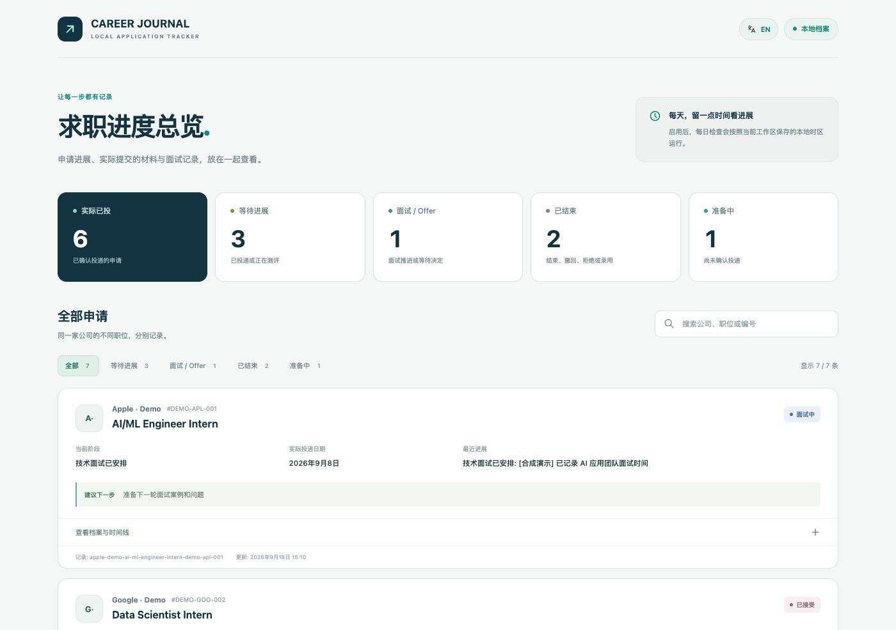

# CAREER JOURNAL

[English](README.md) · [使用指南](docs/getting-started.zh-CN.md) · [更新记录](CHANGELOG.zh-CN.md) · [第三方项目说明](THIRD_PARTY_NOTICES.zh-CN.md)

CAREER JOURNAL 是一款在本地运行的求职管理工具。你可以自己用，也可以交给 AI Agent 操作。它把投递记录、招聘邮件证据、实际提交的材料和下一步行动放在一起，数据库始终保存在你自己的电脑上。

> **Jev 优先判断。** CAREER JOURNAL 已支持 TypeSafe AI 最新发布、目前处于早期体验阶段的 [Jev](https://typesafe.ai/blog/introducing-system-one-models-and-jev)。Jev 会把招聘邮件转换成带置信度的结构化判断，供工作流直接使用。启用后，每封求职邮件都会先交给 Jev 判断；没有 Jev 时，系统会自动改用当前 Agent 的大模型能力，基础流程照常运行。

## 一句话安装

把下面这句话发给 **Codex、Claude Code、Cursor 或其他能够读取仓库的编程 Agent**：

```text
请从 https://github.com/haowen-ai/career-journal 获取最新版本并自动安装配置 CAREER JOURNAL；如果本机已有旧副本，请安全快进，无法安全快进时使用新的隔离副本，然后读取最新 AGENTS.md 并完成首次配置。
```

Agent 会自动完成下载、项目配置、邮箱接入、本机时区检测、每日任务创建、验证和首次运行。你只需要处理无法代办的登录、授权或账号选择。[查看完整使用指南 →](docs/getting-started.zh-CN.md)

## 产品界面



*这张图截自实际运行的本地看板。公司、岗位和申请记录均为虚构的演示数据，不代表真实投递、求职结果、合作关系或官方背书；截图不含个人数据。*

## 它能做什么

- 记录每一份申请、状态变化、截止日期、面试安排和下一步行动
- 支持从限定范围的邮箱、文件、表格或问答整理历史投递，并在你确认后写入
- 识别已经登录的邮箱账号，再以只读方式检查你选中的一个或多个求职邮箱
- 区分生成的草稿、通过检查的文件，以及你确认实际提交的简历或求职信
- 使用 SQLite 保存在本地，并通过 `http://career-journal.localhost:<port>` 打开浏览器看板

## 为 Agent 工作流设计

仓库内的说明会指导兼容的 Agent 完成整个配置流程。除了 Codex 和 Claude Code，也支持其他能够读取仓库说明并创建定时任务的编程 Agent。简历和求职信可以接入独立开源项目 [CareerOps](https://github.com/career-ops-hq/career-ops)，同时使用 CAREER JOURNAL 内置的美式简历规则。

## 文档

- [使用指南与 Agent 配置](docs/getting-started.zh-CN.md)
- [邮箱、自动化、命令行、备份和升级](docs/getting-started.zh-CN.md#邮箱集成)
- [CareerOps 接口说明](docs/integrations/careerops-bridge.zh-CN.md)
- [产品需求文档](docs/superpowers/specs/2026-09-19-job-search-ops-prd-design.md)
- [版本更新记录](CHANGELOG.zh-CN.md)

## 开源说明

CAREER JOURNAL 使用 [MIT License](LICENSE) 发布。项目使用的第三方开源成果及其许可证见 [第三方项目说明](THIRD_PARTY_NOTICES.zh-CN.md) 和 [LICENSES](LICENSES)。
