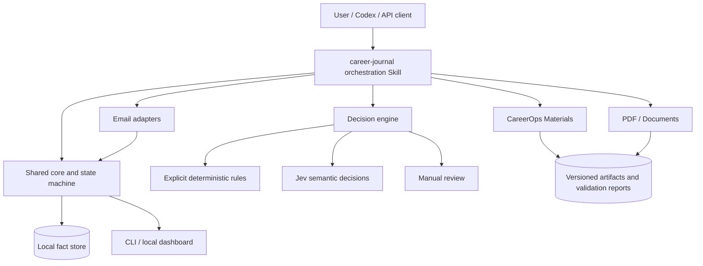

# CAREER JOURNAL Product Requirements Document (PRD)

[English](2026-09-19-job-search-ops-prd-design.en.md) | [简体中文](2026-09-19-job-search-ops-prd-design.md)

**Status:** Review Draft
**Version:** 0.22
**Date:** 2026-09-19
**Product:** CAREER JOURNAL
**Delivery:** Open-source GitHub project with an Agent-managed edition and a provider-neutral LLM API edition

**Revision focus:** Agent-managed onboarding first refreshes or safely replaces a stale local checkout, then discovers mail accounts already signed in on the computer and asks only which one or more are used for job search. If no account is available, the user signs in to a mail app and the Agent resumes. Jev never blocks core onboarding: an existing configured capability is reused, otherwise the current Agent reviews ambiguous candidates without a model Base URL or another API key. After core onboarding passes `doctor`, the Agent makes one optional Jev offer. A user who declines, skips it, or has no access stays on `host-agent`; credentials never enter chat or an Agent prompt. Standalone CLI/API mode continues to support IMAPS and OpenAI-compatible services.

## 1. Product overview

CAREER JOURNAL is a local-first, evidence-driven job-search operating system. It connects job analysis, application-material generation, application tracking, recruiting-email review, interview preparation, and retrospectives in one traceable workflow while retaining the source, date, and artifact version behind every fact.

The product serves different countries, industries, roles, and career stages. It must not assume a school, work, or personal email account, a fixed resume format, a particular job site, or a single model provider. Before onboarding is complete, the user must explicitly select one or more read-only job-search mailboxes, complete trusted verification and an initial read-only sync for each, and register and probe two required daily jobs. Agent mode can record short-lived trusted-host evidence for an account actually observed through the host integration. Standalone mode obtains IMAPS credentials through an environment-variable reference. CAREER JOURNAL never stores passwords, tokens, or cookies.

Two runtime editions share the same domain model, state machine, evidence rules, storage, CareerOps interface, and test fixtures:

1. **Agent-managed edition:** Codex, Claude Code, Cursor, or another repository-aware coding Agent reads the repository instructions and Skills after clone, checks the environment, initializes the workspace, discovers dependencies, and operates the daily workflow
2. **General API edition:** A local CLI and Web UI support replaceable hosted, OpenAI-compatible, local, or self-managed model providers

The Agent-managed edition reuses the current Agent's mailbox and reasoning capabilities. It discovers host accounts before asking the user to select them, and it uses the current Agent when Jev is unavailable. Only the general API edition asks for IMAPS or external-model connection details.

## 2. Problem definition

Job seekers commonly split their work across documents, email, recruiting sites, spreadsheets, and chat tools. This causes them to:

- Lose track of the exact resume or cover letter submitted to a role
- Conflate a generated draft, a submitted application, an acknowledgment, and a stage change
- Scatter assessments, interviews, rejections, and offers across accounts and platforms
- Re-explain experience, writing preferences, and fact boundaries for every document
- Let a model turn JD requirements into unsupported candidate claims or invent metrics, dates, and production status
- Apply automation without deduplication, confidence gates, or human review
- Reimplement the same workflow in different agents and API clients until rules drift

## 3. Goals and non-goals

### 3.1 Core goals

- Connect companies, roles, application state, events, artifact versions, and interviews in one record
- Generate and revise resumes, cover letters, and related materials from the JD and verified candidate evidence
- Make every important fact and state change traceable, reviewable, and reversible
- Require one user-selected read-only mailbox and a successful initial sync for completed onboarding
- Register two required daily jobs in the IANA time zone detected from the user's computer, with `career-journal doctor` as the completion gate
- Give Codex users a low-configuration clone-and-initialize experience
- Give API users provider choice without changing workflow behavior
- Compose CareerOps, PDF, Documents, email, Wiki, and other capabilities through independent Skills or adapters
- Keep primary data local and credentials separate from job-search records

### 3.2 Non-goals for the first release

- Bulk auto-application or bypassing recruiting-site workflows
- Sending email or contacting recruiters without explicit user authorization
- Completing assessments, conducting interviews, or supplying real-time hiring answers
- Inferring rejection from prolonged silence
- Treating a generated artifact as submitted
- A hosted multi-user ATS, agency CRM, or candidate marketplace
- Mandatory access to Jev, one mailbox provider, or one operating system for basic tracking

## 4. Target users

### 4.1 Codex users

Users who want to clone the repository, let Codex discover its instructions and dependencies, configure a local data directory, and manage the workflow in natural language.

### 4.2 API and IDE-agent users

Users of Cursor, other agent IDEs, a CLI, or custom applications who bring their own compatible model API and want local records behind a replaceable provider interface.

### 4.3 Privacy-first users

Users who want records and artifacts to remain local while using an explicitly selected read-only mailbox and a scheduler on their own computer. The host connector or API client owns mailbox credentials; CAREER JOURNAL does not persist them.

## 5. Product principles

1. **Evidence first:** A JD informs targeting; it is never a source of candidate facts
2. **Explicit states:** Draft, submitted, received, reviewed, completed, and actual result remain distinct
3. **Local first:** Core records stay on the user's device, with human- and agent-readable exports
4. **Human-controlled external actions:** Sending, submitting, deleting, archiving, and contacting remain under user control
5. **Capability composition:** The orchestration Skill routes work; specialist Skills perform specialist tasks
6. **Portable configuration:** Personal preferences, regional rules, and templates belong in user overlays, not the public Skill
7. **Honest partial state:** Optional capabilities may degrade explicitly; missing mailbox sync or scheduler proof leaves setup incomplete and `doctor` failing, even when manual local features still work
8. **Idempotent and auditable:** Reimporting one message or event must not create duplicates or roll state backward
9. **Respect upstream work:** Every referenced, called, modified, or distributed third-party Skill and project must receive clear attribution, an upstream link, and license compliance
10. **Real new-user validation:** A release must be cloned from public GitHub into a clean directory; a working development tree is not release proof

## 6. Chosen solution

Use a **thin orchestration Skill plus a shared core and capability adapters**.

The main Skill understands intent, selects a workflow, checks dependencies, calls specialist capabilities, validates structured returns, and records the result. It does not copy CareerOps writing rules or pretend to supply PDF, mailbox, or scheduler capability.

A monolithic Skill would duplicate CareerOps, consume more context, and drift across clients. Fully separate Codex and API products would duplicate state and evidence logic. Both editions therefore use the same deterministic core.

## 7. Architecture



### 7.1 Shared core

The shared core contains deterministic behavior only:

- Application, Event, Artifact, Interview, Source, and Account models
- State transitions and aliases
- Event deduplication and idempotent writes
- Separate occurred, observed, and recorded timestamps
- Evidence levels and conflict resolution
- Skill call contracts
- Storage boundaries for credentials, attachments, and ordinary records
- Import, export, backup, and migration rules

### 7.2 Codex adapter

The root instructions and repository-local `career-journal` Skill bootstrap the Codex edition. Before reading local instructions, the Agent must fetch the current upstream state and either fast-forward a clean checkout or use a fresh isolated clone. Initialization then inspects dependencies, creates ignored local config and data, and discovers signed-in host mail accounts before asking any mailbox setup question. Apple Mail discovery uses the main window and expanded `All Inboxes` account rows, not the selected message, and cross-checks Mail Settings > Accounts when display labels hide addresses. The Agent lets the user select one or more accounts only after the inventory is complete. The Agent itself acts as the host mail connector, records trusted-host evidence, builds and imports bounded read-only batches, and completes the initial sync without waiting for a separate Apple Mail adapter. Because a Codex task supports one heartbeat, the adapter creates one shared heartbeat for the 20:00 and 20:15 schedules, binds its real ID to both task records, and probes the same saved definition against both exact commands. Onboarding stays incomplete until `doctor` confirms fresh verification and sync for every selected mailbox plus both task probes and matching runs.

### 7.3 General API adapter

The general edition uses a provider-neutral interface:

```ts
interface ModelProvider {
  generate(request: GenerationRequest): Promise<GenerationResult>
  structured<T>(request: StructuredRequest<T>): Promise<T>
  healthCheck(): Promise<ProviderHealth>
}
```

The domain layer must not name a specific model. Hosted, OpenAI-compatible, local, and self-managed endpoints extend the same interface.

## 8. Skill orchestration and dependencies

### 8.1 Main `career-journal` Skill

The main Skill identifies whether the user is analyzing a role, preparing materials, recording progress, reviewing email, or preparing for an interview. It reads the current Application and configuration, checks capability health, calls a specialist Skill or local service, validates the result, writes an auditable event, and records sources, output files, hashes, and failure reasons.

It must not duplicate all CareerOps writing and review rules, claim a missing dependency ran, treat generated text as a fact, or turn successful file generation into an application submission.

### 8.2 Dependency manifest

`config/dependency-manifest.yml` records each capability's purpose, level, trigger, install source, upstream repository, author, license, pinned version or commit, health check, and fallback.

| Capability | Default implementation | Level | Trigger | Missing behavior |
|---|---|---|---|---|
| Workflow orchestration | `career-journal` | Required | Every task | Block startup and report the install problem |
| Resume / cover letter | Generalized CareerOps Skill and adapter | Conditionally required | Material generation or revision | Guide enablement; never silently return unaudited prose |
| PDF creation and review | PDF Skill / document adapter | Conditionally required | PDF requested | A text draft is allowed only with clear PDF-not-created status |
| DOCX creation and review | Documents Skill / adapter | Optional | DOCX requested | Offer an available format or enablement guidance |
| Mail reading | Agent mode: discovered read-only host account plus trusted-host proof; standalone mode: built-in read-only IMAPS | Onboarding required | Mailbox selection and first sync | Keep setup incomplete; manual EML and host-authored JSON without observed-account proof cannot replace live proof |
| Scheduling | Codex Automation, probeable OS scheduler, or equivalent host | Onboarding required | Two required daily jobs | `register-external` creates only a pending claim; failed probe blocks setup |
| Jev decisions | TypeSafe adapter / `typesafe-ai` Skill | Primary semantic engine when configured | Existing capability is detected or a standalone user enables it | Explicit rules, current Agent in Agent mode, configured structured LLM in standalone mode, then manual review |
| Wiki / durable knowledge | Wiki adapter | Optional | User enables cross-task knowledge | Project-local config and evidence store |

Authoring tools such as Skill Creator, Skill Installer, or host product documentation Skills are development dependencies, not end-user runtime requirements. The installer must still record which runtime components it generated or installed.

### 8.3 CareerOps generalization and attribution

The public `careerops-materials` Skill adapts [CareerOps](https://github.com/career-ops-hq/career-ops), the MIT-licensed project independently created by Santiago Fernández de Valderrama. CAREER JOURNAL must preserve its upstream attribution and license. Personal absolute paths, templates, and rules must not be copied into the public default.

The adapter preserves CareerOps fact gates, JD matching, generation, rendering, and final-file checks. Templates, regional rules, section order, typography, length, voice, and personal exceptions live in profile or policy overlays. Resume and cover-letter workflows remain separate. The adapter returns a structured artifact inventory, validations, unresolved facts, and hashes, and never marks a generated file submitted.

The README must contain a visible Built With / Open Source Acknowledgements section. `THIRD_PARTY_NOTICES.md`, `LICENSES/`, and the dependency manifest must list actual sources, authors, licenses, versions, and integration modes for CareerOps, TypeSafe's `typesafe-ai/skills`, and other dependencies. Copied or modified MIT code must retain copyright and license text. Inspiration without copied code should still be credited without implying endorsement.

## 9. First use and minimum configuration

### 9.1 Codex edition

After clone, the user may ask Codex to initialize CAREER JOURNAL. The system must:

1. Fetch upstream and use the latest safe checkout: fast-forward a clean existing checkout or create a fresh isolated clone
2. Detect the operating system, repository context, and runtime
3. Validate repository-local Skills and the dependency manifest
4. Create ignored user configuration and a local data directory
5. Ask for or import candidate evidence, existing resumes, and targets
6. Choose locale and language, and detect the computer's current IANA time zone
7. Attempt host mailbox discovery before asking for connection details; ask only which one or more discovered accounts are used for job search, or ask the user to sign in when none is available
8. Record trusted-host verification after observing each selected account and complete a successful read-only sync for every selected mailbox
9. Reuse Jev when already configured; otherwise select `host-agent` automatically, finish the core gates, then make one optional Jev offer after `doctor` passes. A user who declines, skips it, or has no access stays on `host-agent`; never ask the user to paste, send, or provide an API key or secret in chat or an Agent prompt
10. Check CareerOps and document capabilities
11. Create two real jobs in the detected time zone: `mail-sync` at 20:00 and `deadline-review` at 20:15; record real IDs and probe the saved Codex `automation.toml`, launchd, cron, or Windows Task Scheduler definition
12. Trigger each job with its matching ID; the mail task reads every selected account and advances each cursor only after the local transaction commits
13. Run `career-journal doctor`; any missing mailbox proof, successful sync, scheduler probe, or matching run leaves setup incomplete
14. Create or import the first application

### 9.2 API edition

The API path also selects a hosted or local model provider, stores only a reference to its key, tests structured output, sets a budget, and optionally enables Jev. It uses the same live IMAPS path or an independently verifiable mailbox adapter, and the same two required jobs through a probeable OS scheduler or durable worker. Model keys belong in an OS keychain, protected secret store, or runtime environment. IMAPS configuration stores only `env:VARIABLE`; OAuth tokens, passwords, cookies, and literal secrets never enter the database, logs, prompts, or backups.

### 9.3 Mailbox contract

No personal, school, or work account is a default. Agent setup discovers signed-in accounts, shows their addresses, and lets the user select one or more; it does not ask for IMAP settings. Standalone setup shows provider, masked account identity, and read-only scope for the user's chosen account. The public CLI rejects reserved example-domain addresses. The built-in standalone path uses certificate-verified TLS, IMAPS `EXAMINE`, and `BODY.PEEK[]`.

An initial sync may validly find zero new messages. In Agent mode, trusted-host verification is recorded only after the host integration visibly exposes the matching selected account; the subsequent read-only batch includes account, connector, read-only declaration, before and after cursors, unique run ID, fetch time, and verified mail-task ID. Connector-authored JSON alone remains self-attested and cannot prove that the mailbox exists. In standalone mode, verification completes authentication, read-only mailbox opening, UID retrieval, and cursor commit. Missing selection, failed verification, or failed sync for any selected account blocks setup and produces a repair action in `doctor`.

Manual EML is a one-message fallback only. Mailbox integrations are read-only: they never send, reply, delete, archive, modify labels, or click application, assessment, or authentication links.

### 9.4 README onboarding contract

The README leads with one setup sentence that points an Agent at the GitHub repository and explicitly requires the latest version. Codex, Claude Code, Cursor, or another repository-aware coding Agent fetches and fast-forwards a clean existing checkout or uses a fresh isolated clone, reads the current root `AGENTS.md` and repository Skill, attempts host account discovery before asking any mailbox question, completes setup, creates and verifies the two required schedules, runs them once, and finishes with `doctor`. It reads the official TypeSafe Skill only when configuring or changing an enabled Jev integration. The Agent performs the commands; the user is not turned into the installer.

After technical setup passes, the Agent asks whether the user wants to import existing applications. History import is optional and may use a user-bounded read-only mailbox review, an existing file or spreadsheet, or a guided interview. The Agent presents deduplicated candidate records for confirmation before it writes them. Missing dates, statuses, rejection reasons, and submitted-artifact identities remain unknown rather than being inferred, and the user may skip the step.

The README must let a new user install without author explanation. Copyable instructions cover requirements, current-checkout handling, clone and dependency commands, Agent versus standalone API choice, setup, profile import or blank start, Agent-native mailbox discovery or standalone provider configuration, live read-only mailbox verification and first sync, creation and probing of both required jobs in the detected time zone, one run per job, `doctor`, dashboard start, first application, update, uninstall, backup, and local-data removal.

It must explain which functions are fully local, what minimal information optional external APIs receive, each Skill's responsibility, credential ownership, why completed onboarding requires live mailbox and scheduler proof, how Jev is configured without storing its key, and how to inspect versions and third-party licenses.

### 9.5 Daily automation contract

Times are editable defaults interpreted in the IANA time zone detected from each user's computer. The public project must never hard-code the author's time zone or mailbox. A task record alone does not wake a process. `register-external` creates a pending claim. Codex must reread a bounded ACTIVE `automation.toml`; native drivers must reread the actual launchd, cron, or Windows definition. Generated files, placeholder IDs, and direct manual invocations are not proof.

| Local time | Task | Purpose |
|---|---|---|
| 20:00 | `mail-sync` | Read-only sync of the selected mailbox into reviewable events |
| 20:15 | `deadline-review` | Review assessments, interviews, and offers that need action |

Codex uses the host Automation/heartbeat service when available. The API edition uses a probeable OS scheduler or durable local worker. Both obey the same task and cursor contracts. Re-running setup updates the same stable task identities rather than creating duplicates.

Native `automation install` supports `deadline-review`, which does not need mailbox credentials. Native installation of `mail-sync` is blocked because the generated cross-platform definitions do not provide safe secret injection. A trusted external scheduler must provide the environment variable named by `secret-ref`. Codex registration returns an exact `codexCommandLine` containing the absolute Node path, CLI, data home, task ID, and external ID. The heartbeat prompt stores that exact line by itself; live verification checks ACTIVE state, schedule, time zone, and exact argv. Daily consolidation is outside onboarding, and backup is an optional on-demand command.

## 10. Core workflows

### 10.1 Job analysis and application creation

Import or capture a JD with source and snapshot time, extract requirements separately from candidate evidence, create a stable Application ID, and propose next actions without fabricating fit.

### 10.2 Material preparation

Route resumes and cover letters through `careerops-materials`. Use only verified evidence, preserve the user's policy overlay, render and inspect requested formats, save validation results and hashes, and retain draft status until the user confirms the exact uploaded artifact.

### 10.3 Mail review and state updates

Read only the selected mailbox, deduplicate by stable provider identity, classify confirmation, assessment, interview, rejection, offer, marketing, or unknown, attach evidence, and queue uncertain matches for review. Receipt time is not an inferred submission date; silence is not rejection.

### 10.4 Interview preparation and retrospective

Assemble the exact JD, submitted materials, stage, evidence, and known deadlines for preparation. After the interview, record user-provided questions, answers, outcomes, and follow-ups without inventing feedback.

### 10.5 Import, export, and dashboard

The CLI and local dashboard expose filters, timelines, evidence, next actions, artifact versions, and unresolved items. JSON and Markdown exports remain reviewable. The dashboard listens only on loopback and may use `http://career-journal.localhost:<port>` without public DNS.

## 11. Functional requirements

### 11.1 Applications and evidence

- Stable IDs distinguish roles at the same company
- Events are append-only, idempotent, source-linked, and preserve occurred, observed, and recorded time
- Unsupported state transitions fail closed
- Draft, submitted, acknowledged, stage change, and outcome remain separate
- User reports may support an event when the Application is unambiguous; artifact identity still requires the exact file

### 11.2 Materials

- Resume and cover letter generation must invoke CareerOps through `careerops-materials`
- JD facts never become candidate facts
- Prototype, test, backtest, production, and deployed status remain distinct
- Rendered output receives final-file inspection when the capability exists
- Rules and unresolved failures are saved beside each build
- No generated artifact becomes submitted automatically

### 11.3 Email

- Setup requires one or more exact user-selected read-only mailboxes
- Built-in IMAPS uses verified TLS, read-only opening, non-mutating fetch, UIDVALIDITY plus UID cursor, bounded oldest-first pages, and atomic cursor commit
- A failed account does not advance its cursor or corrupt another account
- Host batches use account and external-task binding, compare-and-swap cursors, unique run IDs, size bounds, and atomic evidence writes, but cannot self-certify mailbox health
- Manual EML cannot satisfy onboarding or daily coverage

### 11.4 Decisions and review

- Deterministic rules apply before optional model decisions where appropriate
- Every automated classification records engine, confidence, evidence, and final treatment
- Low-confidence, conflicting, or consequential updates enter a review queue
- Model or Jev output must pass schema and state-machine validation before use

### 11.5 Local UI and API

- Search and filter by company, role, status, and next action
- Show timeline, evidence, submitted artifact, deadlines, and automation health
- Protect loopback-only access, redact secrets, and provide keyboard and screen-reader basics
- Codex and API clients use the same local contracts and fixtures

### 11.6 Automation

- Two stable daily task IDs are mandatory for completed onboarding
- Reconfiguration updates a task instead of duplicating it
- Support list, dry-run, install, verify, update, disable, uninstall, remove, register-external, and unregister-external
- `verify` rereads a supported scheduler's real saved definition
- Any missing live probe or matching successful run within 36 hours blocks `doctor`

### 11.7 Release, upgrade, and feedback

- Every public version has a unique Semantic Versioning number, Git tag, GitHub Release, and CHANGELOG entry
- Every fix explains the problem, affected behavior, resolution, verification, and migration impact
- Release validation includes a remote GitHub fresh-clone smoke test and an upgrade test from the previous stable version
- Schema and configuration changes have versioned, idempotent migrations, a true read-only dry run, backup, and rollback behavior
- Standard Issue templates cover install, configuration, automation, materials, and upgrade problems

## 12. Data model

SQLite is the default fact store, with structured CLI/API access and optional JSON or Markdown snapshots. The storage interface remains replaceable.

- `CandidateProfile`: evidence, preferences, and targets
- `Evidence`: fact, source, confirmation state, and scope
- `JobPosting`: JD snapshot, source, and analysis
- `Application`: company, role, current state, and next action
- `ApplicationEvent`: type, three timestamps, source, and summary
- `Artifact`: resume, cover letter, answer, or related material and its lifecycle state
- `Interview`: stage, time, preparation, questions, and retrospective
- `EmailAccount`: provider, authorization status, and cursor, without literal credentials
- `Automation`: schedule, time zone, external identity, probe, last matching success, and failure state
- `DecisionTrace`: rule, Jev, or structured-LLM result, confidence, manual-review state, and final handling

Attachments use SHA-256 content-addressed references. Secrets remain outside the business database. Backups include an artifact metadata index by default rather than copying artifact payloads.

## 13. Jev integration

TypeSafe AI released Jev in early access on September 15, 2026. CAREER JOURNAL supports it as the primary semantic decision engine after access is configured, keeping the project current with newly available decision technology. Deterministic rules run first for explicit, reviewable cases; Jev handles ambiguous cases that need semantic judgment. In Agent mode, the current Agent reviews candidates when Jev is absent or cannot return a usable decision. In standalone mode, an already configured structured LLM provides that fallback. Jev does not replace generative models used to draft resumes, cover letters, or interview materials.

Agent-managed setup reuses an already configured Jev capability when discoverable; otherwise it selects the current Agent as the semantic reviewer while completing the core gates. After `doctor` passes, the Agent makes one optional Jev offer and asks whether the user wants to enable it. A user who declines, skips the offer, or has no access remains on `host-agent`. If the user chooses Jev, the Agent follows the official TypeSafe console and Skill through a private local credential path; it never asks the user to paste, send, or provide an API key or secret in chat or an Agent prompt. Standalone CLI/API setup may ask whether Jev is enabled and, when it is, stores only an environment reference such as `env:TYPESAFE_API_KEY`; if Jev is absent, that standalone path may configure an OpenAI-compatible base URL, model name, and API-key environment reference. Literal keys never enter config, prompts, logs, or Git. Before Jev questions, criteria, or thresholds change, the implementation reads the official TypeSafe Agent Skill and current API documentation.

The v1 request uses `state`, `model`, and `questions`. Email classification uses one Choice question and reads `answers.classification.choice` plus `confidence`. Explicit rules avoid unnecessary API cost. Ambiguous messages go to Jev first when configured. Missing access, unavailable service, exhausted quota, malformed or unknown output, shadow mode, or low confidence falls back to the current Agent in Agent mode or the configured structured LLM in standalone mode. If that result is also missing, malformed, unknown, or below threshold, the message goes to manual review. HTTP 429 and 529 receive bounded backoff retries; 401 does not retry.

Jev and structured-LLM outputs remain proposed decisions until schema and state validation. Consequential events require original evidence or user confirmation. Thresholds live in one reviewable configuration and must be evaluated against representative messages before limited automation. Pricing, credits, purchase requirements, and access state are not hard-coded because they can change. Release validation covers the v1 contract, Jev priority, structured-LLM fallback, low confidence, malformed output, 401, 429/529, missing credentials, rule bypass, manual review, and one controlled live Jev API smoke test.

## 14. Privacy and security

- Core data is local; enabled external providers receive only the minimum fields required for the task
- `.env*`, secret stores, mailbox tokens, and private user data are ignored by Git
- Logs redact authentication links, tokens, cookies, and sensitive URL parameters
- Users can remove one mailbox, one Application, or all local data
- External-model audits record provider, time, purpose, and field scope, never a key
- Public fixtures, examples, and screenshots use synthetic data only
- Backups redact secret-like fields, clear mailbox health and scheduler registrations, and require re-verification after restore

## 15. Non-functional requirements

- **Portability:** Core CLI runs on macOS, Windows, and Linux
- **Recoverability:** Transactions or atomic replacement prevent partial writes
- **Performance:** Common filters across 1,000 Applications complete locally within 500 ms
- **Testability:** Core logic, adapters, and state transitions have independent contract tests
- **Observability:** Every sync and Skill call reports success, skipped, failed, and pending counts
- **Accessibility:** Dashboard supports keyboard operation, semantic labels, and basic screen readers
- **Internationalization:** UI text, IANA time zone, date format, stage names, and material rules are configurable

## 16. MVP acceptance criteria

1. A new user can complete mailbox selection, live verification, initial sync, two scheduler probes and matching runs, `doctor`, and the first Application within ten minutes
2. Missing or stale mailbox verification or sync, missing scheduler proof, or missing matching run leaves setup incomplete and `doctor` non-successful
3. No default personal mailbox or real personal information exists in code, fixtures, screenshots, or examples
4. Codex and API editions produce the same event deduplication and state transitions for shared fixtures
5. Resume and cover-letter requests invoke CareerOps and save validation status and file hashes
6. Missing PDF capability is reported as incomplete rather than silently claimed complete
7. Repeated import of one message creates no duplicate event
8. One mailbox failure does not advance its cursor or damage successful accounts
9. Draft artifacts never become submitted without explicit evidence
10. Rejection, interview, and offer states require original evidence or user confirmation
11. Missing Jev access keeps basic tracking available and routes ambiguous semantic decisions to the current Agent in Agent mode or the configured structured LLM in standalone mode, then to manual review if no reliable result is available
12. Consequential external writes require an explicit user action and post-action verification
13. A clean environment passes the documented Quick Start smoke test
14. README and third-party notices fully credit CareerOps, TypeSafe's Agent Skill, and every actual dependency
15. Setup detects the computer's IANA time zone and creates 20:00 `mail-sync` plus 20:15 `deadline-review` without duplicating or overwriting explicit custom settings; daily consolidation is outside onboarding and backup is optional on demand
16. Users can pause, edit, and remove tasks; `doctor` reports any resulting incomplete baseline honestly
17. A public remote tag passes a fresh-clone test without untracked development files
18. An independent new-user dogfood run produces reproducible issues and version-planned fixes
19. Upgrade from the previous stable version preserves Applications, events, artifact index, configuration, and valid automation state while clearing proofs that cannot be transferred safely
20. Every release fix has complete CHANGELOG and GitHub Release notes
21. Release files, examples, and logs pass secret and personal-information scans

## 17. GitHub release and version management

### 17.1 Release process

1. Implement code, tests, docs, notices, and licenses on a reviewable branch
2. Review changes before tagging
3. Run unit, integration, documentation, secret, license, migration, and scheduler-contract checks
4. Push an immutable Git tag and create a GitHub Release
5. Clone that tag from the public GitHub remote into a clean directory
6. Complete new-user onboarding and dogfood from the published artifact
7. Record defects as Issues and ship fixes in a new version; never overwrite an existing tag
8. Repeat fresh-install and previous-version upgrade validation

Only a commit or tag available on GitHub and validated from a clean clone is published. A local working tree, unpushed commit, or untracked file is not release evidence.

### 17.2 Version rules

Use Semantic Versioning: MAJOR for incompatible CLI, Skill, configuration, or schema changes; MINOR for backward-compatible capabilities; PATCH for backward-compatible fixes; and `alpha`, `beta`, or `rc` prerelease identifiers. Git tag, CLI `--version`, About page, artifacts, and diagnostics show the same version. Published tags and Releases are immutable.

### 17.3 CHANGELOG and release notes

Maintain `CHANGELOG.md` with Unreleased, Added, Changed, Fixed, Security, Deprecated, Migration, and Known Issues as applicable. Each fix names the user-visible problem, affected versions or capability, change, verification, required reconfiguration or migration, and related Issue or PR. “Bug fixes” or “improvements” alone are insufficient. Skill, prompt, state-machine, schema, and default-behavior changes are user-visible release changes.

### 17.4 Update, migration, and rollback

The documented path includes fast-forward pull, update check, migration dry run, migration, and `doctor`. Before mutation, back up the database, non-sensitive config snapshot, and artifact metadata index without copying payloads by default. Migrations are ordered, versioned, idempotent, and rollback on failure. The dry run does not write. Release notes explain downgrade hazards and any need to rebuild automation or mailbox proof.

### 17.5 Dogfood feedback loop

Each run records version, commit, system, runtime mode, fresh-install or upgrade path, timing, ambiguity, failure point, reproducible steps, redacted evidence, fix version, and verification. Priority order is data or credential risk, install blocker, upgrade blocker, false state, material-fact problem, automation issue, and documentation or UX issue.

## 18. Delivery phases

- **Phase 0 — public contracts:** Remove personal paths, mailbox defaults, and personal rules; define schemas, state machines, dependency manifest, CareerOps adapter, notices, licenses, Quick Start, SemVer, Issue templates, and release checks
- **Phase 1 — local MVP:** CLI, SQLite, exports, Application/Event/Artifact/Dashboard, JD import, material workflow, Codex bootstrap, live mailbox onboarding, two verified jobs, first prerelease, and public-clone dogfood
- **Phase 2 — email and automation expansion:** Add independently verifiable Gmail, Microsoft, and local-mail adapters; improve classification, deadline handling, health reporting, and native scheduler coverage
- **Phase 3 — general API and model gateway:** Provider-neutral models, local Web UI, BYOK, budget limits, structured-output tests, and Codex/API parity
- **Phase 4 — Jev experiment:** Optional adapter, access-state UI, shadow mode, labeled decision set, calibration, and narrowly gated automatic updates only after measured accuracy

## 19. Success metrics

- Onboarding completion rate and time to first Application
- Mail-to-Application match accuracy and correction rate
- Duplicate-event and incorrect-state-update rates
- Percentage of Applications with the exact submitted artifact identified
- Unsupported statements blocked by CareerOps fact gates
- Ability to locate the correct JD, submitted materials, and prep package before interview
- Behavioral parity between runtime editions
- Mailbox verification, first sync, two-task registration, and doctor completion rate
- Core workflow success without model or Jev configuration
- Fresh-clone Quick Start and prior-version upgrade success rates
- Proportion of fixes with reproducible evidence and complete verification notes
- Time from dogfood discovery to published fix

## 20. Risks and mitigations

| Risk | Mitigation |
|---|---|
| CareerOps or host Skill interface changes | Pin versions, probe capabilities, use contract tests and compatibility adapters |
| Model-dependent decisions drift | Schemas, deterministic state machine, shared fixtures, and review gates |
| Misclassified email changes state | Read-only access, retained evidence, confidence gates, and pending review |
| Generated material is mistaken for submitted | Separate draft/submitted lifecycle and exact-artifact confirmation |
| Personal data leaks to GitHub | Ignore secrets, scan releases, and use synthetic fixtures |
| Jev access is unavailable or its API changes | Versioned contract tests, current-Agent or standalone structured-LLM fallback, manual review, and a controlled live smoke test |
| Generalization weakens customization | Profile and policy overlays plus importable personal rules |
| Upstream credit or license is missed | Manifest, notices, license files, and a release gate |
| README commands drift | Clean-environment smoke tests and versioned docs |
| Reinitialization duplicates jobs | Stable task IDs, idempotent updates, and uninstall verification |
| Development works but public clone fails | Remote-tag fresh-clone release gate |
| Upgrade damages records or automation | Versioned migration, backup, dry run, rollback, and upgrade tests |
| Release notes are too vague to guide upgrades | Structured CHANGELOG and release notes tied to reproducible issues |

## 21. Open decisions

The following do not block review: first production model adapters, order of additional mailbox adapters, dashboard framework, CareerOps packaging mode, a possible pure-JSON storage adapter, and the long-term GitHub organization. The product name remains CAREER JOURNAL and the current public repository path is `haowenchen0811/career-journal`.

## 22. External references

- OpenAI Codex Skills: <https://developers.openai.com/es-419/docs/build-skills>
- OpenAI Codex Automations: <https://developers.openai.com/es-419/docs/automations>
- CareerOps: <https://github.com/career-ops-hq/career-ops>
- TypeSafe Jev introduction: <https://docs.typesafe.ai/introduction>
- TypeSafe Jev quick start: <https://docs.typesafe.ai/introduction/quickstart>
- TypeSafe Jev launch and early-access pricing: <https://typesafe.ai/blog/introducing-system-one-models-and-jev>
- Semantic Versioning 2.0.0: <https://semver.org/>
- Keep a Changelog: <https://keepachangelog.com/>
