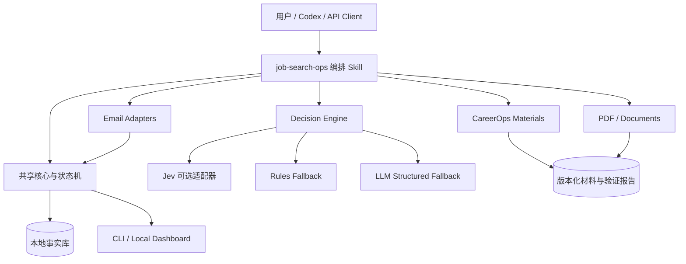

# Job Search Ops 产品需求文档（PRD）

**状态：** Review Draft  
**版本：** 0.11  
**日期：** 2026-09-19  
**工作名称：** Job Search Ops  
**交付形态：** 开源 GitHub 项目，提供 Codex 原生版本和通用 LLM API 版本

**本版更新：** 将第三方 Skill/开源项目署名、许可证保留、可执行 README Quick Start、每日定时任务配置，以及 GitHub 发布后的全新用户实测和版本管理提升为发布前强制要求。

## 1. 产品概述

Job Search Ops 是一个本地优先、证据驱动的求职工作系统。它把岗位分析、申请材料生成、投递记录、邮件进展识别、面试准备和复盘放进同一条可追踪工作流，同时保留每个事实的来源、日期和材料版本。

项目面向不同国家、行业、岗位和职业阶段，不预设学校邮箱、固定简历结构、特定求职网站或单一模型供应商。用户可以只使用基础记录功能，也可以按需连接邮件、CareerOps、文档工具、自动化和第三方决策模型。

系统提供两个运行版本：

1. **Codex 原生版本**：用户克隆仓库后，由 Codex 读取项目说明和 Skill，完成环境检查、初始化、依赖发现与日常操作
2. **通用 API 版本**：通过本地 CLI 和 Web UI 使用，支持可替换的大模型供应商以及 OpenAI-compatible、本地或自建模型

两个版本共用同一套领域模型、状态机、证据规则、数据存储、CareerOps 接口和测试用例，避免行为分叉。

## 2. 问题定义

求职者通常同时使用文档、邮箱、招聘网站、表格和聊天工具，导致以下问题：

- 不知道某个岗位实际提交了哪一版简历或求职信
- 把材料草稿、已发送申请、收到确认和进入下一阶段混为一谈
- 申请、测评、面试、拒绝和 Offer 分散在不同邮箱与平台
- 每次生成材料都重复解释个人经历、写作偏好和事实边界
- 大模型会把 JD 中的要求误写成候选人经历，或补造指标、日期和生产状态
- 自动化缺少去重、置信度门控和人工复核，容易错误更新状态
- 不同 Agent 或 API 客户端重复实现同一流程，长期产生规则漂移

## 3. 产品目标

### 3.1 核心目标

- 用统一记录关联公司、岗位、申请状态、事件、材料版本和面试信息
- 根据 JD 和经过验证的候选人证据生成或修改 Resume、Cover Letter 等材料
- 让每个关键事实和状态变更可追溯、可复核、可撤销
- 邮箱未配置时主动引导配置，同时允许用户跳过并继续使用其他功能
- 让 Codex 用户通过克隆仓库获得最少配置体验
- 让 API 用户自由选择模型供应商，并通过相同工作流获得一致结果
- 通过独立 Skill 和能力适配器复用 CareerOps、PDF、Documents、邮件及其他能力
- 保持数据本地优先，凭据与求职记录分离

### 3.2 非目标

首个版本不提供：

- 自动批量投递或绕过招聘网站流程
- 未经用户授权自动发送邮件或联系招聘方
- 自动完成测评、面试或实时回答招聘问题
- 根据长时间未回复自动推断拒绝
- 把生成过的材料自动标记为已经提交
- 云端多人 ATS、招聘机构 CRM 或候选人售卖服务
- Jev、单一 LLM、单一邮箱或单一操作系统的强制依赖

## 4. 目标用户

### 4.1 Codex 用户

希望将仓库克隆到本地，让 Codex 自动理解项目、检查依赖、配置数据目录并通过自然语言管理求职流程。

### 4.2 API / IDE Agent 用户

使用 Cursor、其他 Agent IDE、CLI 或自建应用，希望通过自己的 API Key 调用任意兼容模型，并保留本地记录与可替换的模型适配层。

### 4.3 手动优先用户

不愿连接邮箱或配置自动化，只希望导入 JD、生成材料、记录投递和查看本地看板。

## 5. 产品原则

1. **证据优先**：JD 只能作为岗位选择依据，不能成为候选人事实来源
2. **状态明确**：草稿、已提交、已收到、已审核、已完成和实际结果必须分别记录
3. **本地优先**：核心记录默认保存在用户设备；导出格式应便于人和 Agent 阅读
4. **人控制外部动作**：发送、提交、删除、归档和联系招聘方均由用户控制
5. **能力组合**：主 Skill 编排流程，专业 Skill 执行专业任务
6. **通用配置**：个人偏好、地区规则和简历模板属于用户配置，不写死在公共 Skill
7. **可降级运行**：邮件、Jev、特定模型或文档工具不可用时，基础系统仍可工作
8. **幂等与可审计**：相同邮件或事件重复导入不能造成重复记录或状态回退
9. **尊重上游产出**：引用、调用、修改或分发第三方 Skill 和开源项目时，必须清楚署名、链接原项目并履行其许可证要求
10. **真实新用户验证**：发布版本必须从公开 GitHub 仓库重新 clone 到干净目录验证，不能以开发工作区可运行代替用户体验

## 6. 方案选择

采用“**薄编排 Skill + 共享核心 + 能力适配器**”架构。

主 Skill 负责理解用户意图、选择工作流、检查依赖、调用专业能力、验证返回值并更新记录。它不复制 CareerOps 的材料生成规则，也不自行模拟 PDF 或邮箱能力。

不采用单体大 Skill，因为它会重复 CareerOps 规则、增加上下文消耗并使不同版本产生漂移；不采用完全分离的 Codex/API 产品，因为两套状态和证据逻辑难以长期保持一致。

## 7. 总体架构



```text
job-search-ops/
├── AGENTS.md
├── .agents/
│   └── skills/
│       ├── job-search-ops/
│       │   └── SKILL.md
│       └── careerops-materials/
│           └── SKILL.md
├── apps/
│   ├── cli/
│   └── dashboard/
├── packages/
│   ├── core/
│   │   ├── domain/
│   │   ├── workflows/
│   │   ├── evidence/
│   │   └── schemas/
│   ├── storage/
│   ├── careerops-adapter/
│   ├── email-adapters/
│   ├── model-gateway/
│   ├── decision-engine/
│   ├── document-adapters/
│   └── automation-adapters/
├── config/
│   ├── config.example.yml
│   ├── dependency-manifest.yml
│   └── schemas/
├── data/
│   └── .gitkeep
├── docs/
└── tests/
```

### 7.1 共享核心

共享核心只包含确定性业务逻辑：

- Application、Event、Artifact、Interview、Source 和 Account 数据模型
- 求职状态转换及状态别名
- 事件去重和幂等写入
- 事件发生时间、观察时间和记录时间的区分
- 证据级别及冲突处理
- Skill 调用契约
- 凭据、附件和普通记录的存储边界
- 导入、导出和迁移规则

### 7.2 Codex 适配器

Codex 版本通过根目录 `AGENTS.md` 和仓库内 `job-search-ops` Skill 启动。初始化程序负责：

- 检查运行环境和依赖 Skill
- 创建本地配置和数据目录
- 导入候选人资料
- 检测邮箱与模型配置
- 调用 Codex 可用的文档、PDF、浏览器和自动化能力
- 在执行前检查所需能力，不把“安装了 Skill”等同于“外部账号已经连接”

### 7.3 通用 API 适配器

API 版本通过统一 `ModelProvider` 接口接入不同供应商：

```ts
interface ModelProvider {
  generate(request: GenerationRequest): Promise<GenerationResult>
  structured<T>(request: StructuredRequest<T>): Promise<T>
  healthCheck(): Promise<ProviderHealth>
}
```

首版可提供若干常见供应商适配器，但领域层不得引用具体模型名称。OpenAI-compatible 和本地模型通过相同接口扩展。

## 8. Skill 编排与依赖

### 8.1 主 Skill：`job-search-ops`

主 Skill 是工作流路由器，职责包括：

- 识别用户是在分析岗位、准备材料、记录进展、检查邮件还是准备面试
- 读取当前 Application 和用户配置
- 检查对应依赖是否存在、是否已经配置、是否可调用
- 调用专业 Skill 或本地服务
- 验证专业模块的结构化返回结果
- 通过共享核心写入事件和状态
- 记录本次操作的输入来源、输出文件、哈希和失败原因

主 Skill 不得：

- 复制 CareerOps 的全部写作与审核规则
- 在依赖缺失时假装已经完成专业检查
- 将模型生成的内容直接视为事实
- 将“生成文件成功”视为“申请已提交”

### 8.2 依赖清单

仓库必须提供机器可读的 `dependency-manifest.yml`，为每项能力记录名称、用途、是否必需、触发条件、安装来源、上游地址、作者、许可证、固定版本或 commit、健康检查和 fallback。

| 能力 | 默认实现 | 级别 | 触发条件 | 缺失时处理 |
|---|---|---|---|---|
| 工作流编排 | `job-search-ops` | 必需 | 所有任务 | 阻止启动并报告安装错误 |
| Resume / Cover Letter | 通用化的 CareerOps Skill 与适配器 | 条件必需 | 生成或修改申请材料 | 引导安装/启用，不静默降级为无审计文本 |
| PDF 创建与检查 | PDF Skill / document adapter | 条件必需 | 用户要求 PDF | 可先交付文本草稿，并明确 PDF 未生成 |
| DOCX 创建与检查 | Documents Skill / document adapter | 可选 | 用户要求 DOCX | 提供可用格式或提示启用依赖 |
| 邮件读取 | Gmail、Microsoft、IMAP 或本地邮件适配器 | 可选 | 用户启用邮件同步 | 保留手动更新流程 |
| 定时任务 | 宿主 Automation adapter | 可选 | 用户启用定时检查 | 提供手动命令 |
| Jev 决策 | TypeSafe adapter / `typesafe-ai` Skill | 实验性可选 | 用户已获得 Jev 权限并启用 | 规则与 LLM Structured Output fallback |
| Wiki / 长期知识 | Wiki adapter | 可选 | 用户主动启用跨任务知识库 | 使用项目本地配置与证据库 |

开发与安装阶段使用的 Skill，例如 Skill Creator、Skill Installer 或宿主产品文档 Skill，不应伪装为最终用户的运行时硬依赖；但安装器必须记录它们生成或安装了哪些运行时组件。

### 8.3 CareerOps 通用化

现有个人 `us-resume-careerops` 是正确的路由模式参考，但包含个人绝对路径、个人模板和个人简历规则，不能原样发布。

公共项目需提供通用 `careerops-materials` Skill：

- 保留 CareerOps 的事实门、JD 匹配、材料生成、渲染和最终文件检查流程
- 将模板、地区规则、章节顺序、字体、篇幅、写作风格和个人例外移动到用户 profile/policy overlay
- 支持 Resume 和 Cover Letter 分离工作流
- 允许添加其他材料类型，而不修改主 Skill
- 返回结构化产物清单、验证结果、未解决事实和文件哈希
- 不在生成后自动标记为已提交

### 8.4 开源署名与许可证合规

README 必须设置清晰可见的 “Built With / Open Source Acknowledgements” 章节，至少列出：

| 项目或 Skill | 上游项目 | 作者/维护者 | 许可证 | 本项目用途 | 集成方式 |
|---|---|---|---|---|---|
| CareerOps | `santifer/career-ops` | Santiago Fernández de Valderrama / santifer | MIT | 岗位分析、材料生成、事实门和求职流程能力 | 固定版本依赖、适配器或经许可修改的代码 |
| TypeSafe Agent Skill | `typesafe-ai/skills` | TypeSafe AI | MIT | Jev 工作流设计与 API 集成参考 | 实验性可选 Skill/adapter |
| 其他运行时 Skill 与库 | 对应官方仓库 | 对应作者 | 实际许可证 | 按真实用途填写 | 按真实方式填写 |

具体接入前必须重新核验上游仓库的当前许可证和版权声明。若复制或修改 MIT 项目代码，发布包必须保留相应版权声明和许可证文本。

仓库还必须包含：

- `THIRD_PARTY_NOTICES.md`：列出所有直接引用、修改、打包和运行时调用的第三方项目与 Skill
- `LICENSES/`：保存需要随发行物分发的许可证原文
- lockfile 或依赖清单：记录实际使用的版本/commit，避免只写项目名称
- 发布检查：检测遗漏的许可证、未知来源文件和未经允许复制的内容

如果某个项目只是提供思路，没有复制代码，也应在 README 的致谢中说明影响来源，但不得暗示上游作者为本项目背书。

## 9. 初次使用与最少配置

### 9.1 Codex 版本

用户克隆仓库后，可对 Codex 输入“初始化 Job Search Ops”。系统执行：

1. 检测操作系统、Codex 项目上下文和运行时
2. 校验 repo-local Skills 与 dependency manifest
3. 创建未提交到 Git 的用户配置和数据目录
4. 询问或导入基础候选人资料、已有简历和目标方向
5. 选择地区、语言和时区
6. 检查邮箱配置
7. 检查 CareerOps 与文档能力
8. 可选配置定时任务
9. 运行 health check
10. 创建或导入第一条岗位记录

### 9.2 API 版本

API 版本初始化增加以下步骤：

- 选择模型供应商或本地模型
- 配置 API Key、Base URL 和默认模型
- 运行结构化输出能力测试
- 设置预算或调用上限
- 选择是否启用 Jev 决策适配器

API Key 只保存在操作系统钥匙串、受保护的本地 secret store 或 `.env.local`；配置文件只保存供应商名称、模型、Base URL 引用和功能开关。

### 9.3 邮箱配置

系统不能预设任何个人、学校或工作邮箱。

若没有可用邮箱，初始化必须显示以下选择：

- 连接 Gmail
- 连接 Microsoft 邮箱
- 配置通用 IMAP
- 检测支持的本地邮件客户端
- 暂时跳过

跳过邮箱后，JD 导入、材料生成、手动进展记录、面试准备和看板仍可使用。系统可以在设置页提示邮箱功能尚未启用，但不得反复阻塞用户。

邮箱默认只读。系统不发送、回复、删除、归档或修改标签，也不点击申请、测评或登录链接。

### 9.4 README 首次配置指南

README 必须让一个没有项目背景的新用户仅按文档就能完成安装，不依赖作者口头说明。Quick Start 至少覆盖：

1. 系统要求和支持的平台
2. `git clone`、进入目录和安装依赖的准确命令
3. Codex 版本与 API 版本的选择方法
4. 执行 `jobops setup` 初始化配置
5. 导入简历、候选人资料或从空白 profile 开始
6. 配置模型 provider；API 版本说明如何使用 `.env.local` 或系统钥匙串
7. 检测邮箱，未配置时选择连接或跳过
8. 配置时区、通知方式和每日任务
9. 执行 `jobops doctor` 检查 Skill、数据库、邮件、模型和自动化状态
10. 执行 `jobops start` 或对应命令打开本地 Dashboard
11. 创建第一条岗位记录的完整示例
12. 更新、卸载、备份和清除本地数据的方法

README 中展示的命令必须可以直接复制执行。技术栈确定后，应以真实命令替换所有占位命令，并在 CI 中执行 Quick Start smoke test。

README 还必须解释：

- 哪些功能完全本地运行，哪些功能会把最少必要内容发送到外部 API
- 每个 Skill 的职责，以及主 Skill 会在什么场景调用它
- 邮件连接、模型 Key、Jev 权限和定时任务都是独立配置项
- Jev 仍可能处于 waitlist；没有 Jev 不影响基本功能
- 如何查看当前版本、已启用依赖和第三方许可证

### 9.5 每日定时任务配置

初始化向导必须逐项展示所有内置每日任务，让用户为每一项明确选择启用、禁用或稍后配置，并在启用时选择本地时区、执行时间、通知策略和使用的邮箱账号。向导不能静默跳过任务配置；公共项目也不得写死作者当前使用的时间、邮箱或任务名称。

首版支持以下可选任务：

| 任务 | 用途 | 默认行为 |
|---|---|---|
| `mail-sync` | 只读检查求职邮件并更新待确认事件 | 未连接邮箱时不创建，并引导配置 |
| `deadline-review` | 检查测评、面试和申请截止日期 | 仅在临近截止或需要行动时通知 |
| `daily-consolidation` | 合并当日新增求职知识、偏好和复盘并去重 | 只整理本项目可访问内容，不读取未授权目录 |
| `local-backup` | 备份数据库、配置快照和材料索引 | 不备份 secrets，可由用户关闭 |

Codex 环境优先使用宿主提供的 Automation/heartbeat；通用 API 版本使用操作系统调度器或常驻本地 worker。两者必须实现同一任务契约。

目标 CLI：

```sh
jobops automation configure
jobops automation list
jobops automation run mail-sync --dry-run
jobops automation update mail-sync
jobops automation disable mail-sync
jobops automation remove mail-sync
```

自动化要求：

- 使用 IANA 时区并正确处理夏令时
- 创建与更新必须幂等，重复运行 setup 不得生成重复任务
- 每项任务保存最后成功时间、最后尝试时间、游标和错误状态
- 失败任务不推进成功游标
- 没有实质新进展时保持安静
- 用户可以随时查看、试运行、暂停、修改和删除任务
- 定时任务只能执行用户在配置时授权的本地和只读操作
- README 必须分别给出 Codex、macOS、Windows 和 Linux 的配置、验证和卸载方法

### 9.6 新用户体验验证

每个可发布版本必须从 GitHub 远端重新 clone 到独立干净目录，按 README 从零配置。该测试不得读取开发工作区中的用户 profile、邮箱、API Key、数据库、全局软链接或未提交文件。

测试分为两条路径：

1. **Fresh install**：没有历史配置的新用户完成 clone、setup、依赖检查、邮箱选择、自动化配置、第一条岗位记录和 Dashboard 启动
2. **Upgrade**：上一稳定版本的用户执行 pull/update、配置迁移、数据库迁移和 doctor，原有数据及 secrets 引用保持有效

用户本人将作为首位 dogfooding 用户，在独立目录中完整体验公开版本。发现的问题必须记录到 GitHub Issue 或版本化 dogfood 记录中，包含环境、版本、复现步骤、预期、实际结果、截图/日志的脱敏引用和严重程度。

开发目录中的成功测试不能关闭该问题；修复后必须在新的干净 clone 或升级副本中复测。

## 10. 核心用户流程

### 10.1 导入岗位并分析

1. 用户粘贴 JD 文本、文件或岗位链接
2. 系统保存来源快照和获取时间
3. CareerOps 生成职责、必备条件、加分项、风险和证据映射
4. 系统区分“JD 要求”和“候选人已证实能力”
5. 用户可创建 Application 或仅保存为候选岗位

### 10.2 生成申请材料

1. 主 Skill 读取岗位、候选人 profile、证据和 policy overlay
2. 调用 `careerops-materials`
3. CareerOps 生成内容并运行事实门
4. 根据请求调用 PDF 或 Documents 能力
5. 检查最终渲染、链接、字体、分页、截断和用户规则
6. 保存 draft artifact、验证报告和 SHA-256
7. 只有用户确认实际使用了该文件后，创建 submitted artifact 版本

### 10.3 记录申请进展

1. 用户手动提供进展，或邮件适配器发现候选消息
2. 系统识别公司、岗位、申请编号和事件类型
3. 无法唯一匹配时进入待确认队列
4. 写入 append-only Event
5. 合法状态转换才更新当前状态
6. 重建本地看板和下一步行动

### 10.4 邮件同步

1. 每个邮箱维护独立游标和重叠查询窗口
2. 仅检索求职相关邮件
3. 使用 provider message ID；缺失时使用发件人、标题、时间和正文摘要组合去重
4. 读取正文判断申请确认、测评、面试、拒绝、Offer 或非进展邮件
5. 不把邮件接收时间自动当成申请日期或内部决定日期
6. 保存最少必要来源信息，不保存认证链接、Cookie 或 Token
7. 无新进展时保持安静；失败邮箱不推进游标

### 10.5 面试准备与复盘

1. 根据该岗位 JD 和实际关联的材料版本生成准备包
2. 提取最可能被追问的事实、项目、技能差距和 STAR 证据
3. 保存练习问题、用户回答、反馈和后续改进
4. 在受限制的正式测评或录制环节，仅做事前准备，不提供违规实时作答

## 11. 功能需求

### 11.1 申请与事件

- **FR-APP-01**：支持公司、岗位、外部 ID、来源 URL、地区和自由标签
- **FR-APP-02**：同公司不同岗位必须拥有独立 Application
- **FR-APP-03**：状态必须来自可配置状态机，保留完整转换历史
- **FR-APP-04**：事件必须区分 `occurredAt`、`observedAt` 和 `recordedAt`
- **FR-APP-05**：未知日期保持为空，不能使用记录日期补齐
- **FR-APP-06**：相同事件重复导入必须幂等；冲突内容不能静默覆盖
- **FR-APP-07**：用户可以纠正匹配、日期、状态和来源，并保留修改记录

### 11.2 材料与证据

- **FR-MAT-01**：支持一个岗位关联多个 draft 和 submitted 版本
- **FR-MAT-02**：submitted 版本必须不可变并保存内容哈希
- **FR-MAT-03**：系统不得把最后生成的 draft 推断成实际上传文件
- **FR-MAT-04**：每条材料事实必须可追溯到 candidate evidence 或用户确认
- **FR-MAT-05**：输出必须保存生成器、模型、policy 版本和验证结果
- **FR-MAT-06**：CareerOps 检查失败或依赖缺失时，材料不得标记为 verified

### 11.3 邮箱

- **FR-MAIL-01**：支持多邮箱，每个邮箱独立授权、游标和错误状态
- **FR-MAIL-02**：未配置邮箱时主动提示一次，并允许跳过
- **FR-MAIL-03**：默认只读，任何写操作必须是独立功能并重新获得明确授权
- **FR-MAIL-04**：营销邮件、人才社区推广和通用职位推荐不能更新申请状态
- **FR-MAIL-05**：邮件服务不可用时必须报告未覆盖范围，不能写成“没有新邮件”
- **FR-MAIL-06**：截止日期需要保留原时区并显示用户本地换算

### 11.4 Dashboard 与检索

- **FR-UI-01**：按公司、岗位、状态、日期、标签和下一步行动筛选
- **FR-UI-02**：岗位详情显示事件时间线、JD、材料、面试记录和证据来源
- **FR-UI-03**：明确标识 draft、submitted、verified 和 verification pending
- **FR-UI-04**：Dashboard 无需联网即可查看本地数据
- **FR-UI-05**：提供 JSON、Markdown 和 CSV 导出；导出不得包含 secrets

### 11.5 文档、署名与安装

- **FR-DOC-01**：README 必须提供从 clone 到第一条岗位记录的可执行 Quick Start
- **FR-DOC-02**：README 必须列出所有直接使用或修改的第三方 Skill、项目、作者、链接、许可证和用途
- **FR-DOC-03**：发行物必须包含适用的第三方版权与许可证原文
- **FR-DOC-04**：`jobops doctor` 必须报告配置状态、缺失依赖和修复步骤，不输出 secrets
- **FR-DOC-05**：README 示例命令必须由 CI 在干净环境中执行 smoke test

### 11.6 自动化

- **FR-AUTO-01**：初始化时允许配置、跳过或稍后启用每日任务
- **FR-AUTO-02**：每个任务独立配置时区、时间、账号、通知和启用状态
- **FR-AUTO-03**：重复配置相同任务必须更新原任务，不能创建副本
- **FR-AUTO-04**：提供 list、dry-run、update、disable 和 remove 操作
- **FR-AUTO-05**：Codex 与通用 API 版本必须遵守同一任务行为和游标规则
- **FR-AUTO-06**：README 必须提供各支持平台的安装、验证与卸载步骤

### 11.7 发布、升级与反馈

- **FR-REL-01**：每个公开版本必须具有唯一 SemVer、Git tag、GitHub Release 和对应 CHANGELOG 条目
- **FR-REL-02**：每项修复必须说明问题、影响、修复内容、验证方法和升级注意事项
- **FR-REL-03**：发布前必须从 GitHub 远端执行 fresh-clone smoke test，防止依赖未提交文件或个人环境
- **FR-REL-04**：至少验证从上一稳定版本升级到当前版本，并保护用户数据和 secret 引用
- **FR-REL-05**：数据库或配置格式变化必须提供版本化 migration、dry-run、备份和失败回滚
- **FR-REL-06**：提供标准 Issue 模板记录安装、配置、自动化、材料生成和升级问题
- **FR-REL-07**：用户可以通过 README 中的准确命令检查更新、拉取版本、运行迁移并验证健康状态

## 12. 数据模型

建议使用 SQLite 作为默认事实库，通过 CLI/API 提供结构化访问，并生成便于 Git、用户和 Agent 审阅的 JSON/Markdown 快照。存储层保留接口，允许未来替换为纯文件或其他数据库。

核心实体：

- `CandidateProfile`：候选人资料、偏好和目标
- `Evidence`：经历事实、来源、确认状态和适用范围
- `JobPosting`：JD 快照、来源和分析结果
- `Application`：公司、岗位、状态和下一步行动
- `ApplicationEvent`：事件类型、三个时间、来源和内容摘要
- `Artifact`：Resume、Cover Letter、回答或其他材料及其版本状态
- `Interview`：阶段、时间、问题、准备与复盘
- `EmailAccount`：provider、授权状态和同步游标，不含明文凭据
- `Automation`：计划、时区、最近成功时间和失败状态
- `DecisionTrace`：规则、Jev 或 LLM 判断及置信度和最终处理

附件存放在内容寻址目录中，以 SHA-256 建立不可变引用。敏感凭据与业务数据库分离。

## 13. Jev 集成

### 13.1 定位

Jev 是实验性、可选的决策引擎，用于封闭选项的分类、评分、路由和置信度门控。它不替代生成 Resume、Cover Letter 或面试材料的大模型。

适合的使用场景：

- 邮件属于申请确认、测评、面试、拒绝、Offer、营销或未知
- 邮件最可能匹配哪个已有 Application
- 当前任务应调用哪个 Skill 或服务
- 是否需要用户复核
- CareerOps 输出是否出现已定义的风险类别

### 13.2 权限与配置

截至本 PRD 日期，Jev 仍为 early access / waitlist。系统不得假设用户已有 API Key。

设置流程必须先询问访问状态：

- 尚未申请：提供官方 waitlist 入口
- 已在 waitlist：记录状态，不显示必填 API Key
- 已获权限：允许配置 `TYPESAFE_API_KEY` 并运行 health check
- 暂不使用：关闭 Jev，使用 fallback

Jev secret 保存到安全 secret store 或 `.env.local`；普通配置仅保存：

```yaml
decision_engine:
  mode: auto
  jev:
    access_state: unavailable
    model: jev-latest
  fallback:
    - rules
    - llm_structured_output
```

### 13.3 Fallback 和安全门

- Jev 不可用、超时、额度不足或置信度不足时，转规则或 LLM Structured Output
- Jev 输出只产生候选决策，必须通过 schema 和状态机验证
- 关键事件需保留原始邮件或用户确认，不能仅凭 Jev 分数更新
- 阈值可配置，并通过离线标注邮件集校准后才能用于自动状态更新
- 首版允许 Jev 进入 shadow mode：记录判断但不改变实际状态

### 13.4 价格说明

TypeSafe 在 2026-09-15 公布的 early-access 价格为每百万输入 tokens 0.042 美元，输出不计费。价格、额度、购买门槛和开放状态可能变化，产品 UI 必须从配置或最新官方信息展示，不能把本文数字当作永久价格。

## 14. 隐私与安全

- 默认本地保存；用户明确启用的外部模型只接收完成当前任务所需的最少内容
- `.env*`、secret store、邮箱令牌和本地个人数据默认不进入 Git
- 日志自动移除认证链接、Token、Cookie 和敏感 URL 参数
- 支持删除单个邮箱连接、单个 Application 或全部本地数据
- 外部模型请求保留 provider、时间、用途和字段范围审计，不记录密钥
- 用户可关闭模型遥测和远程分析
- 公开示例、测试 fixture 和截图不能包含真实个人信息

## 15. 非功能需求

- **NFR-01 可移植性**：macOS、Windows 和 Linux 的基础 CLI 可运行
- **NFR-02 可恢复性**：写入使用事务或原子文件替换，失败不留下半更新状态
- **NFR-03 性能**：1,000 条 Application 的常用筛选在本地 500ms 内完成
- **NFR-04 可测试性**：共享核心、每个 adapter 和状态迁移拥有独立契约测试
- **NFR-05 可观测性**：每次同步和 Skill 调用提供成功、跳过、失败和待确认计数
- **NFR-06 无障碍**：Dashboard 支持键盘操作、语义标签和基本屏幕阅读器
- **NFR-07 国际化**：UI、时区、日期格式、求职阶段和材料规则可配置

## 16. MVP 验收标准

1. 新用户克隆仓库后，可在十分钟内完成初始化并创建第一条岗位记录
2. 未配置邮箱的用户会得到一次明确提示，选择跳过后其他功能正常
3. 仓库、示例配置和测试中不存在默认个人邮箱或真实个人信息
4. Codex 和 API 版本使用同一 fixtures 时，产生相同的事件去重和状态转换结果
5. Resume/Cover Letter 请求实际调用 CareerOps 能力，并保存验证状态和文件哈希
6. PDF 依赖缺失时不得声称 PDF 已完成或已验证
7. 同一封邮件重复同步不会创建重复事件
8. 一个邮箱失败不会推进其游标，也不会影响其他邮箱的成功结果
9. 草稿不会自动成为 submitted artifact
10. 无原始证据或用户确认时，拒绝、面试和 Offer 不会自动成为最终状态
11. Jev 未获权限或未配置时，系统自动使用 fallback，核心流程不受阻
12. 所有外部写操作均需要用户明确触发并在操作后验证结果
13. README 在全新环境中通过自动化 smoke test，用户可按文档完成 clone、setup、doctor 和启动
14. README 与 `THIRD_PARTY_NOTICES.md` 完整列出 CareerOps、TypeSafe Agent Skill 及其他实际依赖的来源和许可证
15. 初始化可创建至少一个每日任务；重复执行不会产生重复任务，并可通过 dry-run 验证
16. 用户可暂停和移除每日任务，移除后调度器中不存在残留任务
17. 发布候选版本从 GitHub 远端全新 clone 后通过完整 Quick Start，不依赖开发机未提交文件
18. 用户完成一次独立的新用户 dogfood 流程，发现的问题具有可复现记录并进入版本计划
19. 从上一稳定版本升级后，Application、事件、材料索引、配置和自动化状态保持正确
20. 每项发布修复都在 CHANGELOG 和 GitHub Release 中写明问题、影响、修复、验证和升级要求
21. 发布包、示例和日志通过 secret 与个人信息扫描

## 17. GitHub 发布与版本管理

### 17.1 仓库与发布流程

项目完成首个可用版本后发布到公共 GitHub 仓库。标准流程为：

1. 在功能分支完成实现、测试、文档和许可证检查
2. 通过 Pull Request 审查，不直接在发布标签上修改
3. 构建 release candidate，并运行单元、集成、文档、secret、许可证和迁移测试
4. 推送 Git tag 并创建 GitHub Release
5. 从 GitHub 远端将该 tag clone 到新的独立目录
6. 用户按 README 作为新用户完成初始化和实际体验
7. 将问题记录为 Issue，修复后发布新的版本，而不是覆盖既有 tag
8. 再次验证 fresh install 与上一稳定版 upgrade 路径

只有 GitHub 上可取得的 commit/tag 通过验证，才可以称为已发布。开发目录、本地未推送 commit 或包含未追踪文件的成功结果不能作为发布证据。

### 17.2 版本规则

使用 Semantic Versioning：

- **MAJOR**：不兼容的 CLI、Skill 契约、配置或数据 schema 变化
- **MINOR**：向后兼容的新功能、新 adapter 或新工作流
- **PATCH**：向后兼容的 bug、文档、兼容性或安全修复
- **Prerelease**：使用 `alpha`、`beta`、`rc` 标记尚未达到稳定标准的版本

版本号必须同时出现在 Git tag、CLI `--version`、应用 About 页面、发布产物和诊断报告中。已经发布的 tag 和 Release 不得重写。

### 17.3 CHANGELOG 与 Release Notes

仓库必须维护 `CHANGELOG.md`，至少包含：

- `Unreleased`
- `Added`
- `Changed`
- `Fixed`
- `Security`
- `Deprecated`
- `Migration`
- `Known Issues`

每个修复条目必须清楚写明：

1. 用户遇到的具体问题
2. 受影响的版本和功能
3. 本版本做了什么修改
4. 如何验证修复
5. 用户更新后是否需要重新配置、迁移或重建定时任务
6. 对应 Issue/PR

禁止只写 “bug fixes”“improvements” 或其他无法判断影响范围的描述。Skill、prompt、状态机、schema 和默认行为的变化都属于用户可见变更，必须记录。

### 17.4 更新、迁移与回滚

README 必须给出类似以下的完整更新路径，最终命令以实现为准并由 CI 验证：

```sh
git pull --ff-only
jobops update --check
jobops migrate --dry-run
jobops migrate
jobops doctor
```

迁移要求：

- 更新前自动备份数据库、非敏感配置和材料索引
- migration 按 schema version 顺序执行并保持幂等
- dry-run 显示将修改的对象数量和风险，不写入真实数据
- 失败时恢复上一版本数据，并保留可脱敏的诊断信息
- 版本降级存在风险时必须在 Release Notes 明确说明
- 依赖 Skill 和第三方库更新必须同步更新 lockfile、NOTICE 和兼容性测试

### 17.5 Dogfooding 反馈闭环

用户会从公共仓库 pull/clone 发布版本，以新用户身份体验安装、配置、邮箱、自动化、岗位、材料、Dashboard 和更新流程。

仓库提供专用 Issue 模板和 `docs/dogfood/` 记录格式。每轮包含：

- 测试版本、commit、系统和运行方式
- fresh install 或 upgrade 路径
- 每一步耗时与需要人工猜测的地方
- 失败点、复现步骤和脱敏证据
- 修复版本、验证结果和是否关闭问题

优先级顺序为：数据损坏或凭据风险、安装阻塞、升级阻塞、错误状态、材料事实问题、自动化问题、文档和体验问题。

## 18. 开发与发布阶段

### Phase 0：公共化与契约

- 把个人路径、个人邮箱和个人简历规则移出公共代码
- 定义领域 schema、状态机和 Skill dependency manifest
- 建立 CareerOps 通用适配器和测试 fixtures
- 建立第三方依赖台账、`THIRD_PARTY_NOTICES.md`、`LICENSES/` 和许可证检查
- 编写 README Quick Start，并在干净环境中建立文档 smoke test
- 初始化公共 GitHub 仓库、SemVer、CHANGELOG、Issue/PR 模板和 Release 工作流

### Phase 1：本地 MVP

- CLI、SQLite 存储、JSON/Markdown 导出
- Application、Event、Artifact 和 Dashboard
- 手动 JD 导入、材料生成与进展记录
- Codex bootstrap 和 repo-local Skill
- 发布首个 prerelease，并完成用户 fresh-clone dogfood

### Phase 2：邮件和自动化

- Gmail、Microsoft 和至少一个通用/本地邮箱方案
- 只读同步、去重、截止日期和定时任务
- 邮箱健康状态与未覆盖范围提示
- Codex heartbeat、macOS、Windows 和 Linux 调度配置及卸载文档

### Phase 3：通用 API 与模型网关

- Provider-neutral ModelProvider
- 本地 Web UI
- BYOK、预算限制、结构化输出测试
- Codex/API 端到端一致性测试

### Phase 4：Jev 实验

- Jev adapter、waitlist/access-state UI 和 shadow mode
- 决策标注集、置信度校准和 fallback 测试
- 只有测试达到预设准确率后才允许有限自动更新

## 19. 成功指标

- 初始化到第一条记录的完成率与耗时
- 岗位与邮件自动匹配的准确率及人工修正率
- 重复事件率和错误状态更新率
- 能找到实际提交材料版本的 Application 占比
- CareerOps 事实门阻止的不受支持陈述数量
- 面试前能够定位对应 JD、材料和准备包的成功率
- 不同运行版本的核心行为一致率
- 邮件、模型和 Jev 未配置时的流程完成率
- fresh-clone Quick Start 成功率及完成时间
- 从上一稳定版升级的成功率、迁移失败率和回滚成功率
- 每个版本中具有完整复现和验证说明的修复占比
- dogfood 问题从发现到发布修复的周期

## 20. 风险与应对

| 风险 | 应对 |
|---|---|
| CareerOps 或宿主 Skill 接口变化 | 版本固定、能力探测、契约测试和兼容层 |
| 不同模型产生不同判断 | schema、确定性状态机、共享 fixtures 和人工复核 |
| 邮件误分类导致状态错误 | 只读、证据保留、置信度门控和待确认队列 |
| 用户把生成材料误认为已提交 | draft/submitted 分离、不可变归档和显式确认 |
| 个人配置泄露到 GitHub | secret scanner、默认 `.gitignore` 和发布前 fixture 检查 |
| Jev 仍在 waitlist 或 API 变化 | 可选 adapter、shadow mode 和双 fallback |
| 通用化削弱个人定制 | profile/policy overlay 和可导入的个人 Skill 包 |
| 漏记第三方作者或许可证 | 依赖清单、NOTICE、许可证扫描和发布门禁 |
| README 命令过时或不可执行 | 干净环境 smoke test 与版本化安装文档 |
| 重复初始化创建多个定时任务 | 稳定任务 ID、幂等更新和卸载验证 |
| 开发环境成功但 GitHub clone 失败 | 远端 tag fresh-clone 发布门禁和未追踪文件检查 |
| 更新破坏用户记录或自动化 | schema migration、自动备份、dry-run、回滚和升级测试 |
| 修复记录含糊导致用户无法判断是否升级 | 结构化 CHANGELOG、Release Notes 和 Issue/PR 关联 |

## 21. 待确认事项

以下选择不阻塞 PRD 审阅，可在实施计划中确定：

- 项目的正式名称和 GitHub organization/repository 名称
- 首批正式支持的 LLM provider adapter
- 首批邮箱 adapter 的实现顺序
- Dashboard 使用的前端技术栈
- CareerOps 以 vendored dependency、Git submodule、npm package 还是独立安装器接入
- SQLite 是否同时提供纯 JSON storage adapter
- GitHub repository 的正式名称、所属账号/organization 和首个公开版本号

## 22. 外部参考

- OpenAI Codex Skills：<https://developers.openai.com/es-419/docs/build-skills>
- OpenAI Codex Automations：<https://developers.openai.com/es-419/docs/automations>
- TypeSafe Jev Introduction：<https://docs.typesafe.ai/introduction>
- TypeSafe Jev Quick Start：<https://docs.typesafe.ai/introduction/quickstart>
- TypeSafe Jev 发布与 early-access 价格：<https://typesafe.ai/blog/introducing-system-one-models-and-jev>
- Semantic Versioning 2.0.0：<https://semver.org/>
- Keep a Changelog：<https://keepachangelog.com/>
